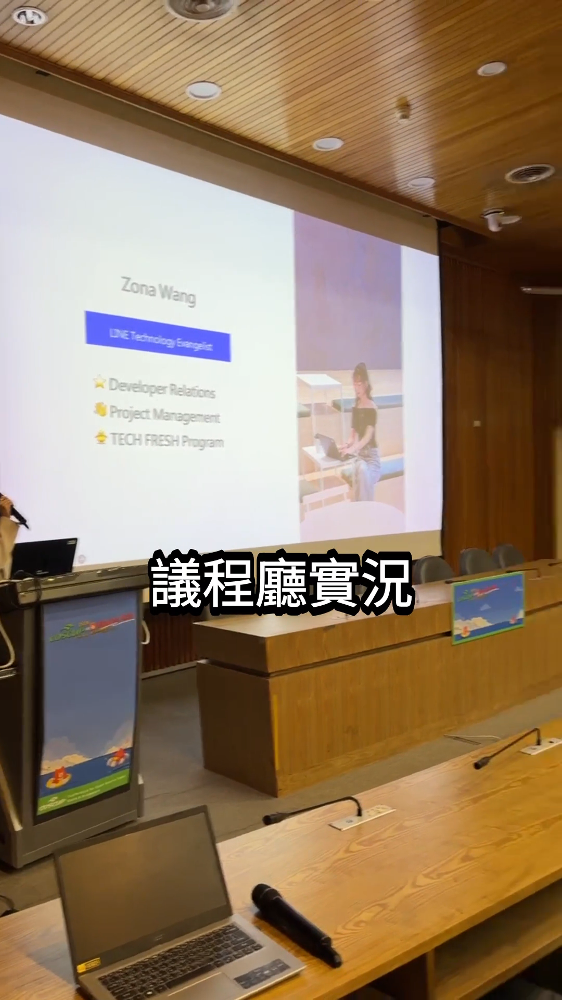

## 前言:

起點是一個誤會。

我看到 Gemini API 文件多了一頁 [Omni](https://ai.google.dev/gemini-api/docs/omni)，介紹一個叫 Gemini Omni Flash 的模型，寫著「原生多模態，同時處理文字、圖片、聲音與影片」。我的第一個念頭很直接：那我把手機裡一整個資料夾的影片跟照片丟進去，讓它先看懂每個素材在拍什麼，再用一句話叫它剪成一支短影片，不就是一個剪片 App 了？

翻完文件發現我理解錯了，而且錯的剛好是最關鍵的那一點。但繞過那個限制之後，剩下的部分是真的做得出來的，成品是 [ReelCraft](https://github.com/kkdai/reelcraft)：一支 Python CLI，把一包影片照片丟進去，Gemini 3.7 Flash 逐個看懂素材、提出剪輯建議，我確認過剪輯清單之後，ffmpeg 剪成 9:16 直式短影片，配樂用 Lyria 3 生成，字幕自動燒上去。

中間有三個問題是 ffmpeg 跟 Gemini 都回報成功、輸出卻是錯的，那種只有真的把影片播出來看才會發現的類型。

# TL;DR

本篇文章會依序介紹：

- <a href="#omni">Omni Flash 不是我以為的那個東西</a>
- <a href="#two-stage">繞過限制：逐檔理解，再用文字彙整</a>
- <a href="#edl">把 edl.yaml 當成人工確認點</a>
- <a href="#gemini37">換上 Gemini 3.7 Flash 之後差多少</a>
- <a href="#lyria">配樂：Lyria 3 走的是另一套 API</a>
- <a href="#ffmpeg-silent">ffmpeg 會安靜地剪錯給你看</a>
- <a href="#captions">字幕：兩個只有真的燒出來才看得到的問題</a>
- <a href="#other-traps">其他幾個坑</a>
- <a href="#summary">結論</a>
- <a href="#refer">參考連結</a>

# Omni Flash 不是我以為的那個東西

<a id="omni"></a>

Gemini Omni Flash（`gemini-omni-flash-preview`）是影片生成與編輯模型，走的是 Interactions API，可以用自然語言對一支影片做效果編輯，例如「當人碰到鏡子時，讓鏡子像液體一樣漂亮地波動」。它不是拿來「看懂一堆影片」的工具。

限制那一段寫得很明白：

> Referencing or reasoning across multiple videos is not supported. Attempting multi-video prompting may result in degraded model performance or unexpected outputs.

另外還有一條：

> Video references up to 3 seconds in duration are accepted by the API schema but are not correctly processed by the model at this time.

所以「丟一堆影片進去讓它自己看懂再剪」這條路，在 Omni Flash 上直接被堵死。真正能做多影片理解的是一般的 Gemini 模型：2.5 之後單次請求最多可以帶 10 支影片，1M context 在預設解析度下大約吃得下一小時的長度，而且可以逐秒 tokenize，輸出帶時間戳的場景描述。

這個誤會花掉的時間不算浪費。查證的過程剛好把「哪件事該由哪個模型做」分清楚了，架構也就跟著定了。

# 繞過限制：逐檔理解，再用文字彙整

<a id="two-stage"></a>

整條 pipeline 拆成五個階段，狀態全部落在檔案上：

```
[素材資料夾]
     │  poc ingest      掃描影片/照片 → catalog.json
     ▼
     │  poc analyze     每個檔案各自呼叫 Gemini → analysis/*.json
     ▼
     │  poc plan        彙整所有分析結果，一次呼叫產生剪輯建議
     ▼                  → summary.md（人看）+ edl.yaml（機器執行）
     ⏸  人工檢查、編輯 edl.yaml
     ▼
     │  poc render      ffmpeg 剪接、裁切 9:16、xfade 轉場
     ▼
output/final.mp4
```

關鍵的設計決策在第二跟第三步：每支影片各自呼叫一次 Gemini，拿到那支影片內部精準的時間戳跟描述；然後把這些文字結果（不是原始影片）一起丟給第二次呼叫，做跨素材的彙整、排序與剪輯建議。

這樣做有兩個好處。一是完全避開「跨影片推理不支援」這件事，因為第二次呼叫看到的只是文字，不是十支影片。二是不受 10 支/request 上限影響，素材再多也只是 analyze 階段多幾次獨立呼叫，那些呼叫本來就可以各自重試、各自失敗而不互相影響。

實測時也證明分開跑的時間戳比較可靠。混在一個 prompt 裡問十支影片「哪幾秒最精華」，模型很容易把不同影片的時間軸搞混。

analyze 階段的失敗處理是分開記的：某個檔案重試三次還是失敗，就寫進 `analysis/_errors.json`，其他檔案照樣跑完。這件事後來被 review 抓到一個漏洞，等下講。

# 把 edl.yaml 當成人工確認點

<a id="edl"></a>

我一開始就決定不做「一鍵全自動」。從素材丟進去到成品輸出中間，一定要有一個我可以動手改的地方，因為 LLM 給的剪輯點就是會有幾個不合理，而重跑整條 pipeline 又要重新付一次 API 費用。

那個介面就是一份 YAML：

```yaml
target_duration_sec: 23
aspect_ratio: '9:16'
clips:
- source: /abs/path/808327978.mp4
  note: 開場鏡頭：展現 COSCUP x UbuCon Asia 活動主視覺背板。
  in: '00:00.000'
  out: '00:02.500'
- source: /abs/path/S__1908753.jpg
  note: 會場趣味彩蛋：現場發放的半導體晶片創意零食。
  duration_sec: 4.0
transitions: crossfade 0.3s
mood_tags: [專業, 歡樂, 社群凝聚]
```

影片用 `in`/`out` 標剪取範圍，照片用 `duration_sec` 標停留秒數，`note` 是 Gemini 寫的挑選理由（後來這個欄位被拿去當字幕，見後面）。想改剪輯點就直接改數字，想換順序就搬動 clip，改完存檔跑 `poc render`。

每個階段的產物都留在 project 目錄，所以任何一步都能單獨重跑。`analyze` 還會跳過已經有分析結果的檔案，重跑不會重複計費，這點在反覆調 prompt 的時候很有感。

`poc plan --theme` 也是後來補的：可以下一句話當剪輯主軸，例如 `--theme "參與 COSCUP 開源社群"`，它會影響 summary 的敘事角度、片段挑選的優先度，以及每個 clip 的 `note` 措辭。因為它只動 plan 階段，換主軸重跑不用重新分析素材，同一批素材想試幾種敘事都很便宜。

# 換上 Gemini 3.7 Flash 之後差多少

<a id="gemini37"></a>

理解跟彙整這兩個階段一開始用的是 `gemini-2.5-flash`，後來換成 [`gemini-3.7-flash`](https://ai.google.dev/gemini-api/docs/models/gemini-3.7-flash)。這顆是 GA 穩定版，不是 preview：

| 項目 | 規格 |
|---|---|
| Model ID | `gemini-3.7-flash` |
| Input | 1,048,576 tokens |
| Output | 65,536 tokens |
| 輸入型態 | 文字、圖片、影片、聲音、PDF |
| 相關能力 | structured outputs、function calling、caching、thinking（low/medium/high） |
| 不支援 | 影片/圖片/聲音生成、Live API |

對這個專案來說最重要的是 structured outputs 跟影片輸入這兩項，因為 analyze 階段就是丟一支影片進去、要回一份固定 schema 的 JSON。

換完之後我沒有只改字串就當作完成，實際打了 API 驗證，而且是拿真的素材跑 `analyze_file`。同一支演講影片，兩顆模型的描述差異相當明顯。

`gemini-2.5-flash` 的版本：

> 影片開始時，一位女性在講台上使用麥克風向聽眾介紹自己，身後的大螢幕顯示著她的名字「Zona Wang」及她的職位介紹。

`gemini-3.7-flash` 的版本：

> 影片中一名女性講者（Zona Wang，LINE Technology Evangelist）在階梯演講廳的講台上進行自我介紹與簡報，隨後鏡頭平移掃過現場專注聆聽演講的聽眾。

差別在「職位介紹」跟「LINE Technology Evangelist」。後者是真的把投影片上那行小字讀出來了，前者只知道那裡有一段職位資訊。

彙整階段的差距更大。同一批 COSCUP 素材、同一句 `--theme`，2.5 給的 summary 是「這支短影片旨在展現 COSCUP 開源社群的活力與多元性。從專業的知識分享、深入的技術交流，到社群成員間熱情的互動與包容」，整段停在抽象層級；3.7 認出了活動全名「COSCUP x UbuCon Asia」、攤位名稱「FOSS for All」與「Kubernetes」，還有一張照片被它描述成「現場發放的半導體晶片創意零食」。這些細節不是我在 prompt 裡提示的，全部來自照片裡的文字跟物件。

對這種「素材理解品質直接決定剪輯品質」的應用，換模型的收益比我預期的大。剪輯建議之所以變好，是因為它真的看懂更多東西，不是因為 prompt 寫得更漂亮。

順帶一提，3.7 的 note 寫法也變了，變成「短標籤：詳細說明」這種格式。這個變化後來害我字幕全爛掉，見後面。

# 配樂：Lyria 3 走的是另一套 API

<a id="lyria"></a>

配樂用 [Lyria 3](https://ai.google.dev/gemini-api/docs/music-generation)。有兩個型號：`lyria-3-clip-preview` 產 30 秒片段，`lyria-3-pro-preview` 產完整歌曲。我的輸出大概 20 秒，用 clip 版剛好。

它不需要另外申請 Vertex AI 或白名單，同一組 Gemini API key 就能用，但呼叫方式跟 `generate_content` 完全不同，走的是 `client.interactions.create()`：

```python
interaction = client.interactions.create(
    model="lyria-3-clip-preview",
    input="An instrumental background music track for a short social-media video, "
          "about 20 seconds long. Mood: 專業, 歡樂, 社群凝聚, 開心. "
          "No vocals, no lyrics, loopable.",
)
audio_bytes = base64.b64decode(interaction.output_audio.data)
```

有幾點跟我原本的想像不一樣。

它沒有結構化參數。長度、BPM、曲風、情緒全部要寫進自然語言 prompt 裡，不是傳 `bpm=120` 這種欄位。所以 `generate_score(mood_tags, duration_sec)` 這個函式的工作，實際上是把情緒標籤跟秒數拼成一句英文。情緒標籤是 plan 階段從各素材分析結果彙整出來的，`poc render --mood "開心,歡樂,慶祝"` 可以再疊加自己想要的方向。

它是單輪生成，不能疊代修改。跟 Omni Flash 的影片編輯不一樣，音樂生出來就定了，不滿意只能重下 prompt。所有生成音訊都帶 SynthID 浮水印。

音樂比影片短的時候要自己處理。clip 版最多 30 秒，影片可能更長，所以混音時用 `-stream_loop -1` 讓音軌無限重複，再用 `-shortest` 裁到影片長度：

```python
cmd.extend(["-stream_loop", "-1", "-i", str(audio_path)])
# ... filter_complex, map video ...
cmd.extend(["-map", f"{audio_index}:a", "-c:a", "aac", "-b:a", "128k", "-shortest"])
```

配樂生成失敗（額度、網路、安全過濾）不會讓整個 render 掛掉，會印警告然後降級成無聲輸出。這條原則後來寫進專案的 CLAUDE.md：任何呼叫外部生成式 API 的加值功能，失敗都要優雅降級，不能讓主線流程死在配角身上。

# ffmpeg 會安靜地剪錯給你看

<a id="ffmpeg-silent"></a>

render 階段用 ffmpeg 的 `xfade` 濾鏡串接片段，每個 xfade 需要一個 `offset` 參數，也就是「從輸出時間軸的第幾秒開始做這次轉場」。累加的邏輯是：前面所有片段長度相加，再減掉每次轉場重疊掉的秒數。

第一版寫完，單元測試全綠，真實素材也剪出了正常的影片。然後 review 找出兩個情境，ffmpeg 都回傳 exit code 0，輸出檔卻是錯的。

情境一是轉場比片段還長，片段會被默默吃掉。兩個各 1 秒的片段，`transitions: "crossfade 2s"`，offset 算出來是 `-1.000`。ffmpeg 收了這個負數、沒有報錯、正常結束，輸出是一支 1 秒的影片，裡面只有第一個片段，第二個整個消失。`EDL.transitions` 是自由文字欄位，我手改 YAML 的時候把 `0.3s` 打成 `3s` 完全是有可能的事，而它不會用任何形式告訴我。

情境二是 `out` 超過素材實際長度，整條後面都會被截掉。一支 10 秒的影片，EDL 寫 `in: 8.0` / `out: 15.0`，實際只能取到 2 秒。後面接一張 1.5 秒的照片，offset 算成 6.700，落在第一條串流結束之後。結果輸出是 2 秒，照片那段完全不見，exit code 依然是 0。這個情境比第一個更該防，因為 EDL 是 LLM 產生的，幻覺一個超出範圍的結束時間是很自然的事。

兩個都補了明確的檢查：算出負 offset 就丟 `ValueError` 並指出是哪個片段、轉場多長；render 之前先用 ffprobe 讀每個影片素材的真實長度，`out` 超過就報錯，寫清楚要求幾秒、實際幾秒。

會這麼在意是因為，成功回報的錯誤輸出比直接崩潰糟糕得多。崩潰我立刻知道要修，而 exit code 0 加上一支看起來正常的 mp4，我可能要等到把影片播完、覺得「怎麼好像少了一段」才會發現，然後完全不知道從哪裡查。

# 字幕：兩個只有真的燒出來才看得到的問題

<a id="captions"></a>


字幕的來源是 EDL 裡每個 clip 的 `note`，也就是 Gemini 寫的剪輯理由。既然它已經替每個片段寫了一句描述，拿來當畫面上的標題剛好。

實作沒用 `drawtext`，改成產一份 SRT 再用 libass 的 `subtitles` 濾鏡燒。原因是 `drawtext` 要自己處理中文字型路徑跟逃脫字元，冒號、逗號、單引號都會跟 filtergraph 的語法打架；SRT 加 `force_style` 乾淨很多，中文字型指定 `FontName=Noto Sans TC` 讓 fontconfig 去找就好。

第一個問題是兩則字幕同時出現在畫面上。第一版每則字幕的顯示區間就用該片段自己的起訖時間，但相鄰片段之間有 0.3 秒的 crossfade 重疊，於是那 0.3 秒內畫面上會有兩行黑底白字疊在一起，很醜。修法是每則字幕的結束時間改成「下一個片段開始時」，而不是自己的結束時間，這樣任何時刻最多只有一則。單元測試不可能抓到這個，因為 SRT 產得完全合法、ffmpeg 也燒得很成功，我是把畫面抽出來看才發現的。

第二個問題是字幕全部拖著一個省略號。`note` 是一整句描述，直接燒上去會塞滿螢幕，所以會截斷成短標題：在第一個逗號或句號斷，找不到標點就用字數上限硬切，有截斷就加「…」。

換到 Gemini 3.7 Flash 之後這套規則全垮了。3.7 習慣把 note 寫成「開場鏡頭：展現 2024 COSCUP x UbuCon Asia 活動主視覺背板」這種「短標籤：詳細說明」的格式，而冒號不在我的斷句字元清單裡，所以整句都掉到字數硬切那條路，八則字幕清一色以「…」結尾。

硬切還有第二個毛病：它完全不管字詞邊界。「呈現女性講者分享關於 ChatGPT 與 Antigravity 的簡報內容」在第 20 個字切下去，畫面上出現的是「⋯⋯與 An…」，一個被砍半的英文單字。

兩件事一起修：冒號視為標籤分界，而且標籤本身就是完整標題，不加省略號；真的要硬切時，如果切點落在一段連續的英文字母數字中間，就往回退到那段英文開始之前，整段捨棄也不要切一半。字數上限順手從 20 放寬到 24。

改完再燒一次，八則字幕變成「開場鏡頭」「議程廳實況」「技術分享特寫」「會場趣味彩蛋」「社群攤位互動」這種乾淨的短標題，一個省略號都沒有。

# 其他幾個坑

<a id="other-traps"></a>

`files.upload()` 回來不代表檔案可以用。這個是 review 階段翻 SDK 原始碼才抓到的，而且它會在真實 API 上炸、在測試裡永遠看不到。`client.files.upload()` 在位元組傳完就回來了，不等伺服器端處理完；影片上傳後會停在 `PROCESSING` 狀態好幾秒，這時候拿它去 `generate_content` 會收到 400 `FAILED_PRECONDITION`。

更糟的是我原本的重試迴圈讓事情雪上加霜：`analyze_file` 整個包在重試裡，所以每次重試都重新上傳整支影片，然後立刻再失敗一次，三次總共只退避了 3 秒左右。三次用完，這個素材就進 `_errors.json`，而 plan 階段當時還不會讀那個檔案，於是素材就這樣無聲無息地從成品裡消失了。修法是加一個 `wait_for_active()`，上傳後輪詢 `client.files.get()` 直到狀態變成 `ACTIVE` 才往下走，並把上傳搬出重試迴圈。

`_errors.json` 寫了沒人讀。承上，analyze 認真記錄了失敗的素材，但 plan 完全沒有讀它，`summary.md` 也不會提。使用者唯一能察覺的方式是自己數成品裡有幾個片段。現在 plan 會把失敗清單附在 summary 後面，明講哪些素材沒有納入剪輯。

重跑 ingest 之後，舊的分析結果會反咬你一口。這個是實際使用時踩到的，不是 review 找的。我中途換了素材資料夾的內容，加了幾張新照片、刪掉幾張舊的，然後重跑 `poc ingest`。`catalog.json` 更新了，但 `analysis/` 底下那些已刪除檔案的分析結果還躺在原地，plan 讀分析結果時沒有跟當下的 catalog 對照，於是把過期素材也餵給了 Gemini。模型很合理地從裡面挑了一個片段，那個檔案卻已經不存在，整個 plan 就失敗了。現在 `load_analyses()` 會拿 catalog 過濾，並印出哪些過期記錄被忽略。

時間戳精度。`format_timestamp` 一開始用 `:04.1f`，只留一位小數。每次 EDL 進出 YAML 就損失最多 0.05 秒，在 30fps 下大約是 1.5 格，剪輯點會慢慢飄。改成 `:06.3f` 留到毫秒。

回頭看，這些問題可以分成兩類。`files.upload` 跟 ffmpeg 靜默出錯是靠 review 逐行讀出來的；字幕疊字、字幕省略號、過期分析結果這三個，是真的把東西跑起來、把影片播出來、換一批素材再跑一次才浮出來的。測試全綠的時候，後面那三個問題都還好好地待在程式裡。

# 結論

<a id="summary"></a>

ReelCraft 現在做的事很單純：一包影片照片進去，一支 9:16、帶配樂帶字幕的短影片出來，中間有一個我可以動手改的 YAML。

架構上真正撐住這件事的是「逐檔理解、文字彙整」這個拆法。它是為了繞過 Omni Flash 不支援跨影片推理而想出來的，結果順便解掉了時間戳精度跟素材數量上限兩個問題。換上 Gemini 3.7 Flash 之後，素材理解的細緻度明顯拉高，剪輯建議跟著變好，這部分的收益比我調 prompt 得到的多。

還沒做的有兩塊：Omni Flash 的單片段生成式修片留了 `touch_up_clip` 的空介面，字幕目前是從 `note` 自動衍生，`text_overlays` 那個欄位還空著。配樂跟字幕都沒有做快取，每次 render 都重新生成一次。

# 參考連結：

<a id="refer"></a>

- [kkdai/reelcraft](https://github.com/kkdai/reelcraft)
- [Gemini 3.7 Flash 模型文件](https://ai.google.dev/gemini-api/docs/models/gemini-3.7-flash)
- [Gemini Omni Flash（影片生成與編輯）](https://ai.google.dev/gemini-api/docs/omni)
- [Gemini 影片理解](https://ai.google.dev/gemini-api/docs/video-understanding)
- [Lyria 音樂生成](https://ai.google.dev/gemini-api/docs/music-generation)
- [ffmpeg xfade 濾鏡](https://ffmpeg.org/ffmpeg-filters.html#xfade)
- [FFmpeg subtitles 濾鏡與 libass](https://ffmpeg.org/ffmpeg-filters.html#subtitles-1)
