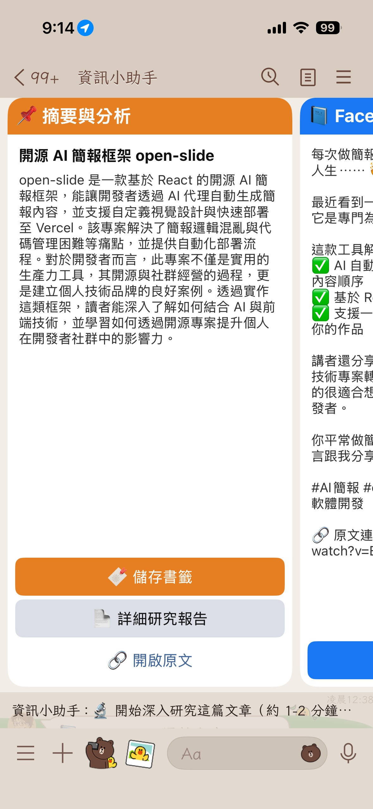
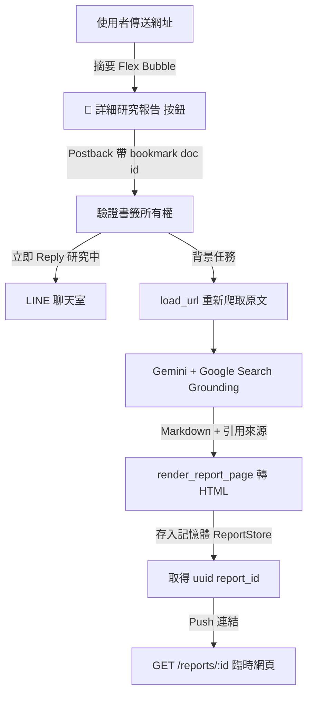

# 前情提要

我的 LINE Bot 一直有個摘要功能：丟一個網址進去，它爬完內容、產一段摘要，附上社群貼文草稿跟儲存書籤的按鈕。這個功能從 2024 年就在了，但它解決的始終是「這篇在講什麼」，而我常常想知道的是另外三件事：

這篇文章講的東西，背景脈絡是什麼？它的說法有沒有其他人反駁過？裡面那些數字，是有出處的還是作者自己講的？

摘要回答不了這些，因為摘要的輸入就只有那篇文章本身。模型手上沒有其他材料，你叫它「批判性分析」，它只能在原文裡繞圈圈，或者開始編。

Google Search Grounding 剛好補的就是這一塊。我在 [之前那篇文章](https://www.evanlin.com/search-grounding/) 裡用它做過搜尋助手，那時候用途是回答問題；這次我想試的是另一種用法：把一篇既有的文章丟給模型，讓它自己去搜尋文章外的資訊，然後回頭審視這篇文章。

成果是摘要卡片上多了一顆「📄 詳細研究報告」按鈕，按下去大約一到兩分鐘後，Bot 會推一個網頁連結給你。

主要 Repo：[https://github.com/kkdai/linebot-helper-python](https://github.com/kkdai/linebot-helper-python)

---

# 為什麼是 Grounding，而不是自己串搜尋

在 Grounding 之前，要讓模型讀到網路上的即時資訊，得自己搭一條管線：先請模型從文章裡抽出關鍵字，拿關鍵字去打搜尋 API，把搜尋結果的網頁一個個爬回來，塞進 prompt，再請模型總結。三次以上的 API 呼叫，每一段都可能斷，而且關鍵字抽得好不好，直接決定後面撈到的東西有沒有用。

Grounding 把這整段收進模型內部。你在 `GenerateContentConfig` 裡掛一個 `google_search` 工具，剩下的模型自己處理：它自己決定要不要搜、搜什麼、搜幾次，搜完自己判斷哪些結果值得用。

對「研究報告」這個題目來說，模型自己決定搜什麼這件事特別有價值。我在寫 prompt 的時候並不知道使用者會丟什麼文章進來，自然也寫不出該搜哪些關鍵字。但模型讀完文章之後知道，它會去找這個主題的來龍去脈，也會去找有沒有人持相反意見。

另一個我很在意的優點是**引用來源會跟著回來**。模型回應的 `grounding_metadata` 裡帶著它實際參考過的網頁，標題跟網址都有。這代表報告裡「根據其他報導」那幾句話，不是模型憑印象講的，而是有對應網頁可以點過去查。做資訊類的產品，這個差別很大。

抽來源的程式碼在 `loader/langtools.py`，寫得防禦一點，因為沒有觸發搜尋時這些欄位整串都不存在：

```python
def _extract_grounding_sources(response) -> list:
    """從 grounding metadata 抽引用來源（同 chat_session 的作法）。"""
    sources = []
    try:
        if getattr(response, 'candidates', None):
            candidate = response.candidates[0]
            metadata = getattr(candidate, 'grounding_metadata', None)
            chunks = getattr(metadata, 'grounding_chunks', None) if metadata else None
            for chunk in chunks or []:
                web = getattr(chunk, 'web', None)
                if web:
                    sources.append({
                        'title': getattr(web, 'title', '') or '',
                        'uri': getattr(web, 'uri', '') or '',
                    })
    except Exception as e:
        logging.warning(f"Failed to extract grounding sources: {e}")
    return sources
```

---

# 系統架構

整條流程從摘要卡片上的按鈕開始，中間經過一次重新爬取跟一次 grounding 呼叫，最後以臨時網頁收尾。



按鈕帶的是書籤的 document id，不是網址本身。這沿用了「儲存書籤」既有的那套機制，好處是拿 doc id 才能在產報告之前，先驗證這份書籤真的屬於這個使用者。反過來說，Firestore 沒接上、拿不到 doc id 的時候，這顆按鈕就不會出現。

---

# 核心實作


## 1. 帶 Grounding 的研究報告生成

`generate_research_report()` 的重點其實不在程式碼，在 prompt。我明確要求模型主動搜尋，並且要求它標注哪些資訊來自搜尋、哪些來自原文：

```python
    prompt = f"""你是一位嚴謹的研究分析師。請針對以下文章內容撰寫一份詳細的研究報告，
繁體中文（台灣用語），Markdown 格式（從 ## 層級開始，不要放文章大標題）。

必要結構：
## 執行摘要（3-5 句話講清楚這篇在說什麼、為什麼重要）
## 背景脈絡（這個主題的來龍去脈，搭配你搜尋到的相關資訊）
## 核心論點與證據（逐點整理文章的主張與支撐證據，標注證據強弱）
## 數據與事實整理（文中的關鍵數字、日期、人物、機構，用表格或清單）
## 對照觀點與批判（搜尋相關報導，比對其他觀點；指出文章的盲點、假設或爭議）
## 延伸問題（3-5 個值得進一步追究的問題）

要求：
- 請主動搜尋補充文章外的背景與對照資訊，並在內文標注資訊來自搜尋還是原文
- 具體優於抽象；沒有根據的推論明確標注「推測」
- 全形標點，不要 AI 腔套語

原文網址：{url}

文章內容：
{text}"""
```

裡面「標注證據強弱」跟「沒有根據的推論明確標注推測」這兩句，是整段 prompt 我最在意的部分。少了它們，報告會每一句都一樣有自信，讀的人分不出哪些是文章講的、哪些是模型從搜尋結果補的、哪些是它自己推的。

掛工具的部分很短，`tools` 給不給就是有沒有 grounding 的差別：

```python
    def _call(with_grounding: bool):
        client = _get_vertex_client()
        tools = [types.Tool(google_search=types.GoogleSearch())] if with_grounding else None
        return client.models.generate_content(
            model="gemini-3.1-flash-lite",
            contents=prompt,
            config=types.GenerateContentConfig(
                temperature=0.4,
                tools=tools,
                max_output_tokens=16384,
                labels={"client_id": "info_helper"},
            )
        )

    try:
        try:
            response = _call(with_grounding=True)
        except Exception as e:
            logging.warning(
                f"Grounded research call failed, retrying without tools: {e}")
            response = _call(with_grounding=False)
```

寫成兩層 try 是因為 grounding 走的是外部搜尋，失敗機率天生比純文字生成高。工具呼叫掛掉的時候，與其回一句「產生失敗」，不如用同一個 prompt 不帶工具重試一次。這時候拿到的是純文章分析，沒有對照觀點也沒有來源，但至少使用者手上有東西。降級是刻意的，不是意外。

## 2. 報告要放在哪裡


報告是完整的 Markdown，動輒好幾千字，塞不進 LINE 訊息，做成 Flex Message 也不合適，因為裡面有表格跟多層標題。所以我讓它變成一個網頁。

但接著就要決定：這些報告要不要存資料庫？

我選擇不存。報告只放在記憶體裡，Cloud Run instance 一回收就消失：

```python
class ReportStore:
    def __init__(self, ttl_seconds: float = DEFAULT_REPORT_TTL_SECONDS):
        self.ttl = ttl_seconds
        self._reports: Dict[str, dict] = {}
        self._lock = Lock()

    def put(self, html: str) -> str:
        report_id = uuid.uuid4().hex
        with self._lock:
            self._purge_expired()
            self._reports[report_id] = {
                "html": html,
                "created_at": time.time(),
            }
        return report_id
```

`report_id` 用 `uuid.uuid4().hex`，因為這個網址沒有登入保護，任何人拿到連結都打得開，id 必須猜不到。頁面本身也加了 `<meta name="robots" content="noindex">`，避免搜尋引擎收錄別人的閱讀紀錄。

## 3. 過期頁面

既然報告會消失，那「連結失效」就不是例外狀況，而是每份報告的正常結局。所以路由寫成這樣：

```python
@app.get("/reports/{report_id}")
def serve_research_report(report_id: str):
    """臨時研究報告頁：過期或 instance 重啟後回過期頁（404）。"""
    html = report_store.get(report_id)
    if html:
        return HTMLResponse(html)
    return HTMLResponse(render_expired_page(), status_code=404)
```

推給使用者的訊息裡我也把話講清楚，不假裝這是永久連結：

```
⏳ 這是臨時頁面，約保留 24 小時（服務休眠後即失效），需要保存請自行複製內容。
```

---

# 重大踩坑與解決方案

## 踩坑一：Grounding 工具和 response_schema 不能並用

這個坑我是在更早之前做地圖餐廳搜尋的時候踩到的。當時我很自然地想：既然要從模型拿餐廳清單，那就用 structured output，掛上 `response_mime_type="application/json"` 跟 `response_schema`，直接拿到型別正確的資料，省得自己 parse。

結果 API 直接報錯。當時的修法就是把 schema 拿掉（commit `a2c8745`），改成請模型輸出 JSON 文字，自己再 parse 一次。

**原因與解法**

Google Search Grounding 跟 structured output 是互斥的。模型在做 grounding 的時候需要自由地穿插搜尋、思考、引用，這個過程沒辦法同時被限制在一個固定的 JSON schema 裡。

所以做研究報告的時候，我一開始就放棄了「回一個結構化物件」的想法，直接讓模型輸出 Markdown 純文字，把結構寫進 prompt 的「必要結構」段落，而不是寫進 schema。

回頭看，這個限制反而讓事情簡單了。報告本來就是要給人讀的長文，Markdown 是它最自然的形態；如果硬拆成 JSON 欄位，最後還是得在渲染的時候拼回一篇文章。真正需要嚴格結構的欄位，只有引用來源，而那個從 `grounding_metadata` 拿就好，本來就不需要 schema。

## 踩坑二：三秒逾時，加上 Gemini 是同步阻塞的

LINE Webhook 要求三秒內回 HTTP 200，但這個功能要重新爬一次原文，再等 grounding 呼叫跑完，整套下來一到兩分鐘。

先講比較少人注意的那一半。`client.models.generate_content()` 是同步阻塞的呼叫，就算你把它包在 `async def` 裡，它照樣會卡住整條 event loop。一個使用者在產報告的那兩分鐘，其他人傳訊息進來也會一起卡住。

**原因與解法**

拆成兩段，reply 跟 push 各司其職：

```python
    url = doc.get("url", "")
    await line_bot_api.reply_message(
        event.reply_token,
        [TextSendMessage(text="🔬 開始深入研究這篇文章（約 1-2 分鐘），完成後把報告連結傳給你。")])

    try:
        crawled_text = await load_url(url)
        # Gemini 呼叫是同步阻塞的，丟 thread 避免卡住 event loop 上的其他任務
        result = await asyncio.to_thread(generate_research_report, crawled_text, url)
```

先用 `reply_message` 回一句「開始研究」，三秒內結束 webhook 請求；重活丟到背景，其中同步的 Gemini 呼叫再用 `asyncio.to_thread` 丟進執行緒。完成之後用 `push_message` 主動把連結送出去。

那句「約 1-2 分鐘」也是刻意寫的。使用者按了按鈕如果三十秒內沒動靜，會開始懷疑是不是壞了，然後重按。先講清楚要等多久，比事後解釋便宜。

## 踩坑三：誰可以看誰的報告

按鈕帶的是 bookmark 的 doc id，如果直接拿這個 id 去查資料、產報告，那任何人只要能構造出 postback，就能讀到別人存的書籤內容。

**原因與解法**

查詢的時候一併驗證所有權，`get_bookmark(user_id, doc_id)` 兩個參數缺一不可，查不到就當作過期處理，不告訴對方「這份存在但不屬於你」：

```python
    doc = svc.get_bookmark(user_id, doc_id) if (doc_id and svc.available) else None
    if not doc:
        await line_bot_api.reply_message(
            event.reply_token,
            [TextSendMessage(text="⚠️ 資料已過期，請重新傳送網址再試一次。")])
        return
```

---

# 成果與效益

實際用下來，這顆按鈕改變的不只是「摘要變長了」。

**摘要跟研究報告回答的是不同問題。** 摘要告訴你這篇在講什麼，適合快速判斷要不要讀；研究報告告訴你這篇講得對不對、別人怎麼看、哪些數字有出處。所以我把它做成兩層而不是把摘要寫長：便宜的那層每次都跑，貴的那層等你真的想深入再按。

**引用來源讓報告可以被查證。** 報告最下面有一份「📚 參考來源」清單，全部來自 `grounding_metadata`，是模型實際讀過的網頁。看到「對照觀點與批判」那一段講了什麼跟原文不一樣的東西，可以直接點過去看原始報導。這是我認為 grounding 比自己串搜尋 API 更值得的地方：省下來的不只是程式碼，還有「這句話從哪來」的可追溯性。

**遇到搜尋失敗也有東西可看。** 降級成純文章分析之後，報告會少掉背景脈絡跟對照觀點，但執行摘要、核心論點、數據整理這幾段照樣在。

**臨時網頁省掉的東西比想像中多。** 不用開資料庫、不用寫清理排程、不用設計報告列表頁，一個 dict 加一把鎖就結束了，安全性靠猜不到的 uuid 撐著。代價是連結會失效，而這件事我在推播訊息裡就講明白了。閱讀這種行為本來就集中在收到連結後的幾分鐘內，為了少數想長期保存的情況去背一整套持久化，我覺得不划算。

如果之後真的需要保存，現在的架構要換也不難：`ReportStore` 的介面只有 `put` 跟 `get` 兩個方法，換成 Firestore 實作，上層完全不用動。

整個功能加起來大約五百行，其中三分之一是測試。程式碼都在 [kkdai/linebot-helper-python](https://github.com/kkdai/linebot-helper-python)，設計文件放在 `docs/superpowers/specs/2026-08-15-research-report-design.md`，有興趣的話可以直接翻。
