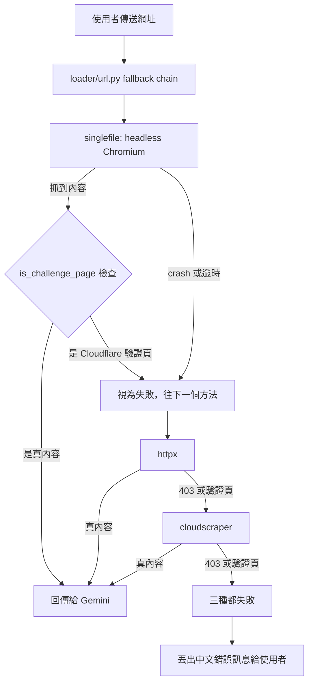

# 前情提要

「網址擷取失敗，幫我看一下 log。」

這種回報我大概一兩週會收到一次，通常都是某個網站又加了一層防爬蟲，查一下讓爬取多一種備援方式繞過去就結束了。這次也是這樣開始的：使用者傳一個 `acm.org` 的網址進來，摘要功能吐了一個錯誤。

查下去才發現不是這麼一回事。網址擷取這個功能已經默默壞了三天，而且問題不在對方網站，是我自己的 Docker image 裡一個沒鎖版本的 npm 套件，某天悄悄升級到一個需要更新版 Node.js 才跑得動的新版本，容器裡的 Node.js 卻還停在半年前裝的那個。

先看 log：

```bash
gcloud logging read 'resource.type="cloud_run_revision" AND \
  resource.labels.service_name="linebot-helper-python" AND \
  textPayload:"acm.org"' --limit=50 --freshness=2d \
  --format="table(timestamp,severity,textPayload)"
```

```
ERROR:loader.url:All methods failed for URL: https://www.acm.org/articles/people-of-acm/2026/russ-cox
WARNING:loader.url:cloudscraper failed ...: 403 Client Error: Forbidden for url: ...
WARNING:loader.url:httpx failed ...: Client error '403 Forbidden' for url: ...
WARNING:loader.url:singlefile failed ...: SingleFile exited with code 1
ERROR:loader.singlefile:SingleFile loading failed ...: SingleFile exited with code 1
```

這個 Bot 抓網頁內容有個 fallback chain：先試 singlefile（headless Chromium 完整渲染），失敗換 httpx，再失敗換 cloudscraper（專門繞 Cloudflare 的工具），三種都失敗才報錯給使用者。httpx 跟 cloudscraper 拿 403 情有可原，acm.org 本來就有防護。但 singlefile 不該失敗，它是設計來繞過這種防護的最後一道防線。

往下翻，找到 singlefile 真正的錯誤：

```
Error: WebSocket is not available, Node.js 22.4.0 or later is required
    at file:///usr/local/lib/node_modules/single-file-cli/lib/deno-polyfill.js:132:8
Node.js v18.20.4
```

容器裡是 Node 18，single-file-cli 卻要求 22.4 以上。查了一下這個錯誤第一次出現的時間是三天前，不是今天才發生。這代表過去三天，只要一個網址前面三種方法有任何一種被擋下來，就會全滅，使用者只會收到一句「無法從網址讀取內容」，完全看不出背後是這個原因。

---

# 為什麼要跑三次 Cloud Build，而不是改完就上線

這篇文章接下來會出現三次「改 Dockerfile → 用 Cloud Build 建置 → 實際跑起來看看」的循環。一開始我沒打算這麼做，覺得改個版本號、看 build 過了就能上線。後來發現這個假設每次都錯。

原因是 `npm install -g single-file-cli` 這種指令，build 成功只代表「npm 找得到這個套件、裝得進去」，不代表「這個套件跑起來的時候能動」。npm 對 `engines` 欄位的檢查預設只是警告，不會讓 build 失敗；而套件真正會不會 crash，要等它實際去啟動一個 headless Chromium、建一條 WebSocket 連線才知道。這中間隔著一層，build log 完全看不出來。

所以這次我沒有停在「build 過了」就收工，而是每改一次版本，就直接在 Cloud Build 裡跑一段 shell，拿容器裡裝好的 `single-file` 去實際抓 `acm.org` 這個真的會失敗的網址。這個習慣後來救了我兩次：如果只看 build 成功就上線，這次的 Dockerfile 改動最後會在正式環境重演一次一模一樣的 crash，只是換一種錯誤訊息。

---

# 系統架構

修完之後，網址擷取的失敗處理長這樣：



原本只有「crash 或逾時」這條路會被判定失敗；`is_challenge_page` 那個分支是這次新加的，後面會講為什麼需要它。

---

# 核心實作

## 1. Dockerfile：把 Node.js 跟 single-file-cli 都鎖死版本

修之前，這段 `RUN` 指令長這樣：

```dockerfile
RUN apt-get update && \
    apt-get install -y --no-install-recommends \
        nodejs \
        npm \
        git \
        chromium \
        ffmpeg \
    && npm install -g single-file-cli \
    && apt-get clean \
    && rm -rf /var/lib/apt/lists/*
```

兩個問題都在這幾行裡。`apt-get install nodejs` 抓的是 Debian 內建 apt 源的版本，長期停在 v18；`npm install -g single-file-cli` 完全沒鎖版本，每次重新 build image 都會抓 npm 上當下的最新版。這兩件事分開看都不嚴重，合在一起就是一顆不知道哪天會爆的地雷：single-file-cli 什麼時候提高 Node.js 需求，完全不是我能控制的事，而我的容器版本卻是寫死的。

改完之後：

```dockerfile
# Node.js 與 single-file-cli 版本都鎖死，避免未來 rebuild 時默默抓到不相容的新版：
# - Node.js：改用 NodeSource 24.x（Debian apt 內建的 v18 太舊），鎖精確版號。
#   single-file-cli 依賴的 ws/simple-cdp 需要全域 CloseEvent，Node 24 才有（Node 22 沒有，
#   即使開 --experimental-websocket 也一樣，實測過），這是這次 acm.org 爬取全滅的根本原因
# - single-file-cli：鎖在 2.0.83，已驗證在 Node 24 下可正常抓取
RUN apt-get update && \
    apt-get install -y --no-install-recommends \
        ca-certificates \
        curl \
        gnupg \
        git \
        chromium \
        ffmpeg \
    && mkdir -p /etc/apt/keyrings \
    && curl -fsSL https://deb.nodesource.com/gpgkey/nodesource-repo.gpg.key | gpg --dearmor -o /etc/apt/keyrings/nodesource.gpg \
    && echo "deb [signed-by=/etc/apt/keyrings/nodesource.gpg] https://deb.nodesource.com/node_24.x nodistro main" > /etc/apt/sources.list.d/nodesource.list \
    && apt-get update && apt-get install -y --no-install-recommends nodejs=24.19.0-1nodesource1 \
    && npm install -g single-file-cli@2.0.83 \
    && apt-get clean \
    && rm -rf /var/lib/apt/lists/*
```

`nodejs=24.19.0-1nodesource1` 跟 `single-file-cli@2.0.83` 這兩個精確版號，不是隨便挑的，是三輪 Cloud Build 實測換出來的，下面「重大踩坑」那段會講怎麼換到這兩個數字。

## 2. 偵測 Cloudflare 驗證頁

singlefile 不會 crash 之後，我以為事情結束了，直到我真的拿它去抓 `acm.org`：

```
== single-file fetch acm.org (headless chromium) ==
OK: 18400 bytes
<title>Attention Required! | Cloudflare</title>
```

抓「成功」了，抓回來的卻是 Cloudflare 的人機驗證頁，不是文章本文。問題是這個功能完全沒有偵測這種情況。httpx 跟 cloudscraper 對 4xx/5xx 會呼叫 `raise_for_status()` 直接失敗，但 headless Chromium 渲染出來的頁面永遠是 HTTP 200（瀏覽器拿到什麼就顯示什麼），這一層檢查對 singlefile 完全不存在。驗證頁的文字就這樣被送去給 Gemini，使用者收到的會是一段莫名其妙、跟原文章毫無關係的摘要，而且看起來像是正常回覆，不會有任何錯誤提示。

補上的偵測邏輯，放在 `loader/html.py`：

```python
# Cloudflare／WAF 人機驗證頁的常見特徵字串。singlefile 用 headless Chromium
# 渲染頁面，不像 httpx/cloudscraper 會對 4xx/5xx 呼叫 raise_for_status()，
# 抓到驗證頁也會當成「抓取成功」回傳——這裡專門攔這種情況，抓到就要當失敗，
# 讓 loader/url.py 的 fallback chain 換下一種方法，不能把驗證頁內容送去給 Gemini。
CHALLENGE_PAGE_MARKERS = (
    "Attention Required! | Cloudflare",
    "Just a moment...",
    "Checking your browser before accessing",
    "cf-browser-verification",
    "Enable JavaScript and cookies to continue",
    "DDoS protection by Cloudflare",
)


def is_challenge_page(text: str) -> bool:
    """抓回來的內容是否為 Cloudflare／WAF 人機驗證頁而非真正網頁內容。"""
    return any(marker in text for marker in CHALLENGE_PAGE_MARKERS)
```

三個 loader（httpx、cloudscraper、singlefile）都接上這個檢查，抓到驗證頁一律當失敗處理，讓 fallback chain 換下一個方法：

```python
if is_challenge_page(resp.text):
    raise RuntimeError(f"httpx got a bot-challenge page instead of real content: {url}")
return parse_html(resp.text, markdown=markdown)
```

---

# 重大踩坑與解決方案

## 踩坑一：錯誤訊息講的版本號不能照單全收

一開始看到 `Node.js 22.4.0 or later is required`，很自然地就把容器升到 Node 22，build 也順利過了。改完想著大概沒事了，直到我真的去跑 single-file 抓 acm.org，才拿到另一個完全不同的錯誤：

```
ReferenceError: CloseEvent is not defined
    at #onClose (.../single-file-cli/node_modules/simple-cdp/mod.js:334:36)
Node.js v22.23.2
```

single-file-cli 依賴的 `ws` 套件在處理連線關閉事件時，會去 `new CloseEvent(...)`，前提是執行環境要有一個全域的 `CloseEvent` 類別。我在容器裡直接跑了一段探測：

```bash
node -e "console.log('WebSocket', typeof WebSocket, 'CloseEvent', typeof CloseEvent)"
# WebSocket function CloseEvent undefined

node --experimental-websocket -e "console.log('CloseEvent', typeof CloseEvent)"
# CloseEvent undefined
```

Node 22.23.2 有全域 `WebSocket`（那個「22.4.0 以上」的錯誤訊息檢查的其實只是這個），但沒有 `CloseEvent`，開實驗性 flag 也一樣沒有。換成 Node 24.19.0 再測一次：

```bash
node -e "console.log('CloseEvent', typeof CloseEvent)"
# CloseEvent function
```

**原因與解法**：single-file-cli 自己內部那段版本檢查（`deno-polyfill.js` 裡寫的「Node 22.4 以上」）檢查的只是它自己會用到的第一個 API，不代表它所有依賴用到的 API 都在那個版本齊全。真正會擋路的是更下游、更少人會去查的那個 `CloseEvent`，直到 Node 24 才變成全域可用。看到錯誤訊息裡的版本號，最多當成起點，不能直接當終點。真的要跑起來，才知道實際會卡在哪一行。

## 踩坑二：npm 的「最新版」是一個會動的靶

升到 Node 22 之後，本來想著這件事就過去了，直到使用者要求「順便把版本鎖一下，避免以後又出事」。查 single-file-cli 目前 npm 上的資訊：

```bash
npm view single-file-cli engines
# { deno: '>=2.2', bun: '>=1.2', node: '>=24.0.0' }
```

最新版要求的是 Node 24 以上，不是我之前修的 22。查發布時間才發現這其實是同一週內連續發生的兩次跳號：

```bash
npm view single-file-cli time --json | grep -E "2\.0\.83|2\.1\.0"
#   "2.0.83": "2025-11-29T23:34:16.671Z"
#   "2.1.0":  "2026-08-16T15:56:28.819Z"
```

2.0.83 是去年 11 月的版本，`engines` 寫的是 `node >= 20`，穩定用了大半年；8 月 16 號發布的 2.1.0 直接把門檻拉到 `node >= 24`，而我這邊第一次觀察到 crash 是 8 月 20 號，中間剛好隔了一次 image rebuild 的時間差，兜得起來：某次重新 build 時 `npm install -g single-file-cli` 沒指定版本，默默抓到了剛發布沒幾天的 2.1.0。

**原因與解法**：`npm install -g <package>`（沒帶版號）在 CI/CD 或 Dockerfile 裡本質上是「每次重新 build 都可能裝到不同東西」，這件事在套件維護者連續兩次調高 Node 版本需求的當下就會直接引爆。鎖版本不是保守，是把「這個容器什麼時候會壞」從「看套件作者心情」換成「看我自己什麼時候決定升級」。我最後選的是 2.0.83，不是最新，是最後一個明確標示相容 Node 20 的穩定版；沒選最新的 2.1.3，去湊 Node 24 那個新門檻。

## 踩坑三：build 成功不等於裝進去的東西能跑

這條在前面「為什麼要跑三次 Cloud Build」已經講過原因，這裡補一段實際發生的樣子。鎖定 Node 24 + single-file-cli 2.0.83 之後，`gcloud builds submit` 順利跑完，`Successfully built` 也印出來了。如果只看這一步的 build 成功訊息，很容易誤以為問題已經解決。但我第一次讓 build 通過的其實是 Node 22 那個版本，實際跑起來會在「踩坑一」那個 CloseEvent 的問題上炸掉：build 成功這件事本身，並不能證明容器裡的東西真的能動。

我在 Cloud Build 設定裡多加了一個 step，直接拿剛 build 好的 image 去跑：

```yaml
steps:
- name: 'gcr.io/cloud-builders/docker'
  args: ['build', '-t', 'nodefix-verify', '.']
- name: 'nodefix-verify'
  entrypoint: 'bash'
  args:
    - '-c'
    - |
      node -v
      single-file --version
      single-file --browser-executable-path=/usr/bin/chromium \
        --browser-args='["--no-sandbox","--disable-dev-shm-usage"]' \
        "https://www.acm.org/articles/people-of-acm/2026/russ-cox" /tmp/out.html \
        && echo "OK: $(wc -c < /tmp/out.html) bytes"
```

第一次跑這段，就是它抓出了「踩坑一」那個 `CloseEvent is not defined`。第二次跑（Node 24 + 2.0.83），才真正看到 `OK: 18400 bytes`。

**原因與解法**：`npm install` 對 `engines` 不匹配預設只印警告，不會讓指令失敗；`docker build` 的成功只代表每一層指令的 exit code 都是 0。這兩件事合起來，代表「build 過」跟「這東西能正常運作」之間完全沒有必然關係。把「實際跑一次目標情境」寫進驗證流程裡，才補得起這個落差。

## 踩坑四：抓到內容不代表抓到對的內容

「踩坑三」的驗證印出 `OK: 18400 bytes` 的時候，我一開始以為問題已經解決了，直到看到那 18400 bytes 裡的 `<title>` 寫著 `Attention Required! | Cloudflare`。這才意識到：即使 single-file-cli 完全正常運作、真的用 headless Chromium 把頁面渲染出來，Cloudflare 還是可能因為偵測到這是無頭瀏覽器而擋下請求，回傳一個驗證頁。這個驗證頁對 single-file-cli 來說，跟一篇正常文章長得一模一樣：都是抓到了 HTML，都能存檔，都算「成功」。

加上 `is_challenge_page` 檢查之後，第一輪測試沒有全過：

```
FAILED test_load_html_with_httpx_raises_on_challenge_page
FAILED test_load_html_with_cloudscraper_raises_on_challenge_page
```

檢查邏輯明明看起來沒錯，httpx/cloudscraper 兩個測試卻抓不到驗證頁。查下去發現，`loader/html.py` 的 `load_html_with_httpx` 是先把 HTML 轉成 markdown（用 `markdownify`）才回傳，而 `markdownify` 不會保留 `<title>` 這種放在 `<head>` 裡、瀏覽器不會顯示成正文的標籤，我的偵測字串「Attention Required! | Cloudflare」剛好就是那個被丟掉的 `<title>`，轉完 markdown 之後根本不在文字裡了。更麻煩的是 `cf-browser-verification` 這一條，它在真實的 Cloudflare 頁面裡是一個 CSS id（`<div id="cf-browser-verification">`），本來就只存在於 HTML 屬性裡，不管是 markdown 轉換還是純文字擷取（`get_text()`）都不會把屬性值當成文字內容。

**原因與解法**：把檢查點從「處理過的文字」搬到「原始 HTML」：

```python
# 部分驗證頁特徵（如 cf-browser-verification）只出現在 HTML 屬性裡，
# markdownify/get_text 抓不到，所以要在轉換前先檢查原始 HTML
if is_challenge_page(resp.text):
    raise RuntimeError(f"httpx got a bot-challenge page instead of real content: {url}")
return parse_html(resp.text, markdown=markdown)
```

singlefile 那邊也是同樣的調整，原本是先用 `BeautifulSoup` 把檔案轉成純文字才檢查，改成直接讀原始 bytes 先檢查一輪，通過才交給 `BeautifulSoup` 處理：

```python
with open(f, "rb") as fp:
    raw_html = fp.read()

if is_challenge_page(raw_html.decode("utf-8", errors="ignore")):
    raise RuntimeError(
        f"SingleFile got a bot-challenge page instead of real content: {url}")

soup = BeautifulSoup(raw_html, "html.parser")
text = soup.get_text(strip=True)
```

這個坑的教訓是：寫防護邏輯的時候，要清楚知道自己檢查的是哪一層資料。同一份內容，經過不同的轉換（HTML → markdown、HTML → 純文字）之後，資訊會不對稱地流失：有些字看得到，有些只存在屬性裡，兩種擷取方式都碰不到。

---

# 成果與效益

改完之後跑了一次真正的端對端測試，直接在容器裡呼叫 Python 這邊實際會用到的 `load_url()`，對著同一個 acm.org 網址：

```
INFO:loader.url:Trying singlefile for URL: ...
ERROR:loader.singlefile:SingleFile loading failed ...: SingleFile got a bot-challenge page instead of real content: ...
WARNING:loader.url:singlefile failed ...
INFO:loader.url:Trying httpx for URL: ...
WARNING:loader.url:httpx failed ...: 403 Forbidden
INFO:loader.url:Trying cloudscraper for URL: ...
WARNING:loader.url:cloudscraper failed ...: 403 Forbidden
ERROR:loader.url:All methods failed for URL: ...
Raised as expected: Exception 無法從網址讀取內容，請確認網址是否正確或稍後再試
```

三種方法照樣都失敗，acm.org 背後的 Cloudflare 防護沒有被繞過，這點沒變。變的是失敗的方式：以前是 singlefile crash 拖垮整條 fallback chain，讓使用者連「已經試過三種方法」這件事都不知道；現在是三種方法都乾淨地各自失敗，使用者收到清楚的錯誤訊息，而不是一段看起來正常、內容卻是 Cloudflare 驗證頁的假摘要。

**鎖版本解決的是「未來會不會又壞」，不是「acm.org 這個網址能不能抓到」。** 這兩件事一開始很容易被我混在一起：鎖了版本、single-file-cli 不再 crash，很容易就覺得問題解決了，但 Cloudflare 那一關本來就不是這次要處理的範圍，也沒有簡單的解法（真的要繞過去大概要上瀏覽器指紋偽裝那一套，投入產出比不划算）。這次做到的是把「爬蟲被擋」跟「我自己的容器壞掉」這兩種失敗徹底分開，後者不該再因為 npm 版本漂移而復發。

**「build 成功」不能當作驗證通過。** 這是這次收穫最大的一條。如果每次改完 Dockerfile 只看 build log 有沒有紅字，這次至少會漏掉兩個問題：Node 22 那次的 `CloseEvent` crash，以及即使 singlefile 完全正常運作，Cloudflare 驗證頁依然會被當成正文送出去。兩個都是「build 沒問題、實際跑起來才炸」的類型，只有真的拿目標網址跑一次才看得到。

**防護邏輯要對齊實際會拿到的資料層級。** 踩坑四那個 `markdownify` 把 `<title>` 吃掉的問題，如果不是先寫測試、跑起來看到 `DID NOT RAISE`，大概會一直以為自己已經修好，直到某天使用者又回報一次一模一樣的問題。

這次總共改了四個檔案：`Dockerfile`、`loader/html.py`、`loader/singlefile.py`，加一份新的測試 `tests/test_challenge_page_detection.py`，全專案跑完 150 個測試全過。程式碼在 [kkdai/linebot-helper-python](https://github.com/kkdai/linebot-helper-python)。
