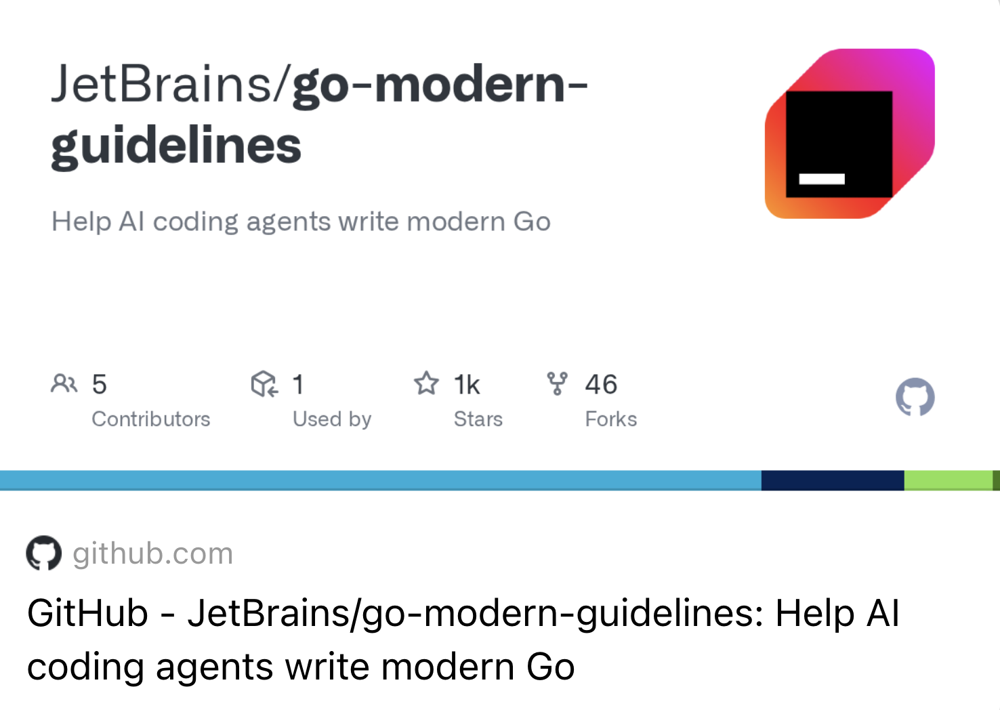
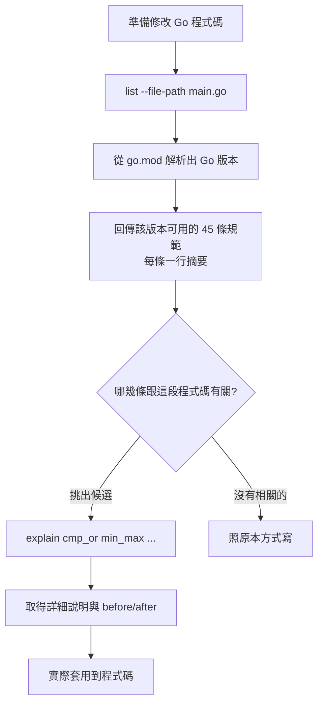
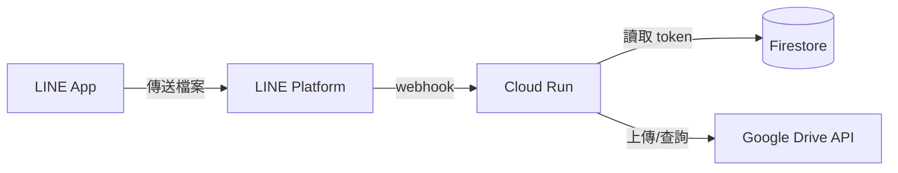

# 前情提要

AI 時代下，連我自己都會將大部分得程式碼優化或是寫作的部分都會麻煩 AI 代勞。但是因為模型訓練的資料因素，有太多的寫作方式都太老舊了。這樣造成寫出來的程式無法應用到最新版本 Go 的一些功能，這樣相當的可惜。 

還好， JetBrains 出了 go-modern-guidelines 這個很好用的 plugin 。可以讓你的 AI Agent 變得更加的聰明，並且知道該如何使用最新的程式語法來優化你的 Golang 程式碼。

---

# 什麼是 go-modern-guidelines？

## 它想解決的問題：模型的知識有截止日，Go 沒有

這個專案的定位寫得很直白：**為 AI agent 提供當代的 Go 撰寫規範，讓它們不會因為知識截止日而寫出過時的 Go。**

問題有兩層。第一層很好理解：模型訓練資料有截止時間，截止之後才進標準庫的東西，它沒看過就不會用。專案自己舉的例子是 `errors.AsType[T]`（Go 1.26），模型沒見過，自然不會寫。

第二層比較微妙，專案稱之為 **frequency bias**：就算模型「知道」新寫法，訓練資料裡舊寫法出現的次數還是壓倒性地多。網路上十年份的 Go 程式碼裡，`interface{}` 的出現次數遠遠多於 `any`，`sort.Slice` 遠多於 `slices.SortFunc`。模型是在做機率預測，多數決贏的往往是舊的那個。

這第二點我在這次重構裡真的看到了。原本專案裡有這麼一段：

```go
// The oauth2 library can return an error containing "invalid_grant"
// when the refresh token is expired, revoked, or otherwise invalid.
if err != nil {
    errorStr := err.Error()
    // Basic substring check to avoid importing "strings"
    for i := 0; i <= len(errorStr)-13; i++ {
        if errorStr[i:i+13] == "invalid_grant" {
            return true
        }
    }
}
```

一段手刻的字串搜尋，註解還特地解釋「為了避免 import strings」。`strings` 是標準庫，import 它的成本是零。這段程式碼要的其實就是一行 `strings.Contains(err.Error(), "invalid_grant")`。

## 它怎麼運作：兩個指令，一份隨 Go 版本增長的清單

工具本體是一支 CLI，只有兩個子指令：

```
list [--go-version <version> | --file-path <path>]
    回傳這個 Go 版本支援的規範清單，由新到舊排序。

explain <id>...
    回傳特定規範的詳細說明與 before/after 範例。
```

`list` 的設計重點在於**它會依 Go 版本回答不同的答案**。你可以直接丟一個檔案路徑給它，它會自己往上找 `go.mod`、`go.work`，或退而求其次看本機的 Go toolchain：

```bash
$ go-modern-guidelines list --file-path ~/Documents/linebot-file/main.go
```

我這個專案的 `go.mod` 寫 `go 1.24.0`，所以它回了 45 條。換個版本號，數字就跟著變：

| Go 版本 | 規範數 |
|---------|-------:|
| 1.21 | 32 |
| 1.22 | 37 |
| 1.23 | 41 |
| 1.24 | 45 |
| 1.25 | 46 |
| 1.26 | 48 |
| 1.27 | 54 |

這個設計是刻意的：**它只會建議你的專案版本真的能用的寫法。** 對 AI agent 來說這很關鍵，不然它可能會很開心地建議你用 `errors.AsType[T]`，然後你的 CI 因為跑在 Go 1.24 上直接掛掉。

看一下版本之間差在哪，其實就是一份 Go 近年新特性的濃縮清單：

```bash
$ diff <(list --go-version 1.21) <(list --go-version 1.22)
> range_over_int: Use for i := range n when iterating from 0 to n-1.
> loopvar_capture: Do not add redundant loop-variable copies before closures or
  taking addresses; Go 1.22 gives each iteration its own variables.
> cmp_or: Use cmp.Or to pick the first non-zero value from a fallback chain.
> reflect_type_for: Use reflect.TypeFor[T]() instead of reflect.TypeOf((*T)(nil)).Elem().
> http_servemux_patterns: Use method-aware ServeMux patterns and r.PathValue for
  path parameters.
```

`list` 給的是一行摘要，真的要動手時再用 `explain` 拿詳細說明。輸出長這樣：

```
$ go-modern-guidelines explain cmp_or

cmp_or:
  Since: Go 1.22

  Summary:
    Use cmp.Or to pick the first non-zero value from a fallback chain.

  Details:
    cmp.Or returns the first non-zero value from its arguments. It is concise
    for simple fallback chains, but remember that all arguments are evaluated
    before the call.

  Examples:

  Before:
    name := os.Getenv("NAME")
    if name == "" {
      name = "default"
    }

  After:
    name := cmp.Or(os.Getenv("NAME"), "default")
```

注意 `Details` 那段最後補的那句：「所有參數在呼叫前都會被求值」。這是 `cmp.Or` 真正的陷阱——如果你的 fallback 來源是一個昂貴的函式呼叫，寫成 `cmp.Or(a(), b())` 會兩個都執行。這種「可以用，但要知道代價」的提醒，比單純叫你換寫法有用得多。

## 兩層資訊的設計，其實是為了省 context

這個 list／explain 分層乍看只是介面設計，實際上是為了 AI agent 的 context window。45 條規範，每條一行摘要大概 1000 個 token 就講完了；但如果每條都附上完整說明跟 before/after 範例，光是塞這份清單就要燒掉幾萬個 token。

所以流程是：先 `list` 掃過全部，判斷哪幾條跟眼前這段程式碼有關，再只對那幾條呼叫 `explain`。這次我實際只 `explain` 了六條。



skill 的說明文件裡還有一條規定寫得特別重：**不要把 `list` 的輸出接到 `head`、`tail`、`grep` 後面**，因為可能會漏掉重要的規範。這條我第一次就違規了，後面「踩坑」那段會講。

## 安裝

Claude Code 的話兩行：

```
/plugin marketplace add JetBrains/go-modern-guidelines
/plugin install modern-go-guidelines@goland-claude-marketplace
```

裝完之後遇到 Go 相關任務會自動觸發，也可以手動叫：`/modern-go-guidelines:use-modern-go`。Cursor、Junie、Codex 有各自的安裝方式，其他 agent 可以走 `npx skills add JetBrains/go-modern-guidelines`。專案採 Apache 2.0 授權。

第一次執行時，wrapper script 會自己去把 CLI 裝到本機快取目錄：

```
go-modern-guidelines: installing github.com/JetBrains/go-modern-guidelines@v0.1.1
  into /Users/xxx/.cache/go-modern-guidelines/v0.1.1
```

---

# 這次的專案：一支長到 1039 行的 main.go

先交代一下背景。linebot-file 的架構不複雜：



使用者用 `/connect_drive` 授權，token 存 Firestore，之後傳到聊天室的檔案就會自動上傳到 `LINE Bot Uploads/YYYY-MM/` 這樣的資料夾結構下。功能是陸續加上去的，所有東西都堆在 `main.go`，其中 `main()` 這個函式本身就佔了 564 行。

---

# 健檢找到什麼

這段跟 go-modern-guidelines 沒有直接關係——它管的是「寫法夠不夠當代」，不是「邏輯對不對」。但這些才是真正會咬到使用者的東西，還是記一下。

## 一、編譯得過，卻永遠不會執行的一段程式

這是最有意思的一個。原本的事件處理長這樣：

```go
switch e := event.(type) {
case webhook.MessageEvent:
    switch message := e.Message.(type) {
    case webhook.TextMessageContent:
        // ...
    case webhook.FileMessageContent:
        // ...
    case webhook.FollowEvent:          // ← 注意這裡的縮排層級
        if s, ok := e.Source.(*webhook.UserSource); ok {
            bot.LinkRichMenuIdToUser(s.UserId, richMenuConnect)
        }
    }
}
```

`webhook.FollowEvent` 被寫在**內層** switch 裡了。內層 switch 判斷的是 `e.Message`，型別是 `MessageContentInterface`——一個 follow 事件永遠不可能是一則訊息的內容。

那為什麼編譯得過？Go 對型別 switch 是有檢查的，case 的型別如果不可能實作那個 interface，編譯器會報 `impossible type switch case`。問題出在這個 SDK 的 interface 定義：

```go
type MessageContentInterface interface {
    GetType() string
}
```

只要求一個 `GetType() string`。而 `FollowEvent` 剛好也有這個方法（所有事件型別都有），所以它在型別系統上「可以」是一個 `MessageContentInterface`，編譯器放行，執行期永遠不匹配。

實際後果：**新使用者加好友時，引導授權的 Rich Menu 從來沒有被綁定過。** 這功能大概壞了很久，因為它不會報錯，只是安靜地什麼都不做。

## 二、群組訊息會 panic

```go
userID := e.Source.(webhook.UserSource).UserId
```

未檢查的型別斷言，出現了六次。只要機器人被拉進群組、有人在裡面傳一張圖，這行就 panic。

順帶一提，同一支檔案裡另外幾個地方寫的是 `e.Source.(*webhook.GroupSource)`（指標）。查了 SDK 的 `UnmarshalSource`，它回傳的是**值**不是指標，所以那幾個帶 `, ok` 的斷言永遠是 false，同樣是死碼。同一個檔案裡兩種寫法都錯，方向還相反。

## 三、`/recent_files` 回傳的是資料夾

```go
// 上傳時：檔案放進 LINE Bot Uploads/YYYY-MM/
monthFolderID, _ := findOrCreateFolder(srv, "2026-08", mainFolderID)
srv.Files.Create(&drive.File{Parents: []string{monthFolderID}})

// 查詢時：只找 LINE Bot Uploads 底下
query := fmt.Sprintf("'%s' in parents and trashed=false", mainFolderID)
```

檔案存在月份子資料夾，查詢卻只看根資料夾。在 Google Drive 的資料模型裡資料夾也是一種 file，所以這個查詢確實會回傳東西——回傳的是 `2026-08`、`2026-07` 這些資料夾本身。

## 四、使用者輸入直接串進 Drive query

```go
query := fmt.Sprintf("... and name contains '%s'", searchQuery)
```

沒有跳脫。使用者搜尋 `it's`，那個單引號就把查詢語法打斷了；再往下想，也可以塞進額外的查詢條件。修法是老實寫一個跳脫函式，注意順序不能反：

```go
// 反斜線必須先跳脫，否則為了跳脫引號而加進去的那個反斜線，
// 會被第二輪處理再跳脫一次
func escapeDriveQuery(s string) string {
    s = strings.ReplaceAll(s, `\`, `\\`)
    return strings.ReplaceAll(s, `'`, `\'`)
}
```

## 五、`/quit` 被當成搜尋指令

```go
} else if (len(message.Text) > 13 && message.Text[:13] == "/search_files") ||
          (len(message.Text) > 2 && message.Text[:2] == "/q") {
    commandPrefixLen := 0
    if ... {
        commandPrefixLen = 14  // "/search_files " 的長度
    } else if ... {
        commandPrefixLen = 3   // "/q " 的長度
    }
    searchQuery = message.Text[commandPrefixLen:]
```

手工切字串，而且寫死了「後面一定接一個空白」。使用者打 `/quit`，前兩個字是 `/q`，於是變成搜尋 `it`。

---

# go-modern-guidelines 實際改了哪些地方

回到主題。`list` 那 45 條裡，真正套用到這次改動的有這些：

## `http_servemux_patterns`：連帶砍掉一段手寫的路徑檢查

原本的寫法是所有請求都進同一個 handler，再自己判斷路徑：

```go
http.HandleFunc("/", func(w http.ResponseWriter, req *http.Request) {
    // LINE Platform 一定是 POST 到 webhook URL
    if req.URL.Path != "/" {
        http.NotFound(w, req)
        return
    }
    // ...
})
```

Go 1.22 之後 `ServeMux` 的 pattern 支援方法與精確路徑：

```go
mux := http.NewServeMux()
// "/{$}" 只匹配根路徑，而不是它底下的所有路徑
mux.HandleFunc("POST /{$}", webhookHandler)
mux.HandleFunc("GET /oauth/callback", oauthCallbackHandler)
mux.HandleFunc("GET /healthz", healthHandler)
```

`{$}` 這個語法是關鍵：`"/"` 在 ServeMux 裡是 subtree pattern，會吃掉底下所有路徑，這也是為什麼原本的程式碼需要那段手寫檢查。`"/{$}"` 只匹配根路徑本身，檢查就不用寫了。順手還把 method 限制、健康檢查端點一起補上。

## `cmp_or`：三段 fallback 變成三行

```go
// Before
port := os.Getenv("PORT")
if port == "" {
    port = "5000"
}

// After（順手把預設值改成 8080，對齊 Dockerfile 的 EXPOSE 與 Cloud Run 慣例）
port := cmp.Or(os.Getenv("PORT"), "8080")
richMenuConnect = cmp.Or(os.Getenv("RICH_MENU_CONNECT"), defaultRichMenuConnect)
richMenuMain = cmp.Or(os.Getenv("RICH_MENU_MAIN"), defaultRichMenuMain)
```

這裡剛好符合 `explain` 提醒的使用條件：三個參數都是 `os.Getenv` 跟常數，全部求值也沒有副作用。

## `strings_cut_prefix_suffix`：把手工切字串換掉

前面第五點那段 `message.Text[:13]` 的指令解析，換成正規的解析函式：

```go
func parseCommand(text string) (name, arg string, ok bool) {
    text = strings.TrimSpace(text)
    if !strings.HasPrefix(text, "/") {
        return "", "", false
    }

    name, arg, _ = strings.Cut(text, " ")
    switch name {
    case cmdConnect, cmdReconnect, cmdDisconnect, cmdRecent, cmdSearch, cmdSearchShort:
        return name, strings.TrimSpace(arg), true
    }
    return "", "", false
}
```

改成 `strings.Cut` 先切出完整的指令名稱、再用 switch 比對，`/quit` 那個 bug 就從結構上消失了——它切出來的 name 是 `/quit`，不在允許清單裡，直接回 false。

## `slices_sort_func` + `min`：修掉那個假的排序

原本的搜尋結果去重之後長這樣：

```go
// Remove duplicates and sort by creation time (newest first)
uniqueFiles := make(map[string]*drive.File)
for _, file := range files {
    if _, exists := uniqueFiles[file.Id]; !exists {
        uniqueFiles[file.Id] = file
    }
}

result := make([]*drive.File, 0, len(uniqueFiles))
for _, file := range uniqueFiles {
    result = append(result, file)
}

if len(result) > 10 {
    result = result[:10]
}
```

註解寫「sort by creation time (newest first)」，實際上從頭到尾沒有任何排序動作——**map 的迭代順序是隨機的**，然後直接砍掉前 10 筆。所以使用者拿到的是隨機的 10 筆，不是最新的 10 筆。

```go
// Drive 回傳的 createdTime 是 RFC 3339 UTC 字串，直接做字串比較就是正確的時間順序
func sortAndTrimFiles(files []*drive.File, limit int) []*drive.File {
    slices.SortStableFunc(files, func(a, b *drive.File) int {
        return cmp.Compare(b.CreatedTime, a.CreatedTime)
    })
    return files[:min(len(files), limit)]
}
```

`min` 這個內建函式（Go 1.21）在這裡省掉一個 if。

## `any`、`errors_is`：小地方

`map[string]interface{}` 換成 `map[string]any`，這種一行的東西不用多說。

## `crypto/rand.Text()`：一個需要先升版本的建議

原本產生 OAuth state 的寫法：

```go
func generateState() string {
    b := make([]byte, 16)
    rand.Read(b)  // 錯誤被忽略
    return base64.URLEncoding.EncodeToString(b)
}
```

Go 1.24 新增的 `crypto/rand.Text()` 直接回傳一個隨機字串，不會失敗，而且輸出是 base32（`A-Z`、`2-7`），天然就是 URL-safe，正好適合當 state 跟 Firestore 的 document ID：

```go
func generateState() string {
    return rand.Text()
}
```

但這條有前提，下面會講。

---

# 重大踩坑與解決方案

## 踩坑一：skill 明確叫你不要 grep，我第一次就照做了相反的事

skill 文件寫得很清楚：

> Do not pipe the output through head, tail, grep, sed, or any other truncating/filtering command. Important guidelines may otherwise be missed.

我第一次呼叫的時候打的是：

```bash
$ go-modern-guidelines list --file-path main.go 2>&1 | tail -60
```

純粹是怕輸出太長洗版的反射動作。事後才發現這在兩個層面上都很危險：一是 `list` 明講是**由新到舊排序**，`tail` 拿到的正好是最舊那批；二是這次剛好沒出事，只是因為當時 `go.mod` 寫的是 1.23，總共 41 行，小於 60，所以 `tail -60` 把整份都印出來了。

**原因與解法**：純運氣。如果專案當時是 Go 1.27（54 條），`tail -60` 一樣不會截斷；但如果我打的是 `head -20` 或 `grep slices`，就會漏掉整批東西，而且完全不會有任何提示告訴我漏了。這種「輸出被截斷但看起來很正常」的失敗最難發現。老實把完整輸出讀完就好，45 行而已。

## 踩坑二：工具建議的寫法，你的 go.mod 不一定准你用

`rand.Text()` 出現在建議清單裡，但專案的 `go.mod` 當時是：

```
module github.com/kkdai/linebot-file

// +heroku goVersion go1.21
go 1.23.0

toolchain go1.24.3
```

`go 1.23.0` 這行決定的是**語言版本**，跟 `toolchain` 是兩回事。工具是照著能解析到的版本回答的，但要真的用 `rand.Text()`，得動 `go.mod`。

這不是無腦改一行就好，得先確認整條鏈上的東西都對得起來：`toolchain` 已經是 `go1.24.3`，Dockerfile 用的是 `golang:1.24-alpine`，兩邊都沒問題。倒是 CI 有問題——`.github/workflows/go.yml` 裡寫死 `go-version: '1.22'`，比 `go.mod` 要求的還舊，目前是靠 Go 的 toolchain 自動下載機制才沒炸。

**原因與解法**：`go.mod` 提到 `go 1.24.0`，順手把那行過時的 `// +heroku goVersion go1.21` 也清掉（這專案早就跑在 Cloud Run 上了），CI 則改成以 `go.mod` 為單一事實來源：

```yaml
- uses: actions/setup-go@v5
  with:
    # 以 go.mod 為單一事實來源，避免 CI 與專案版本不一致
    go-version-file: go.mod
```

## 踩坑三：改了 go.mod 之後，工具的答案就變了

這是這次最有意思的一個發現。升完 `go.mod` 之後，我在寫測試前又跑了一次 `list`，發現清單最前面多了四條之前沒有的：

```
testing_t_context: Use t.Context() when a test function needs a context tied to
                   the test lifetime.
json_omitzero:     Use omitzero on JSON-tagged bool, numeric, struct, and time
                   fields whose zero value should be omitted...
testing_b_loop:    Use b.Loop() for the main loop in benchmark functions.
strings_split_seq: Use strings or bytes SplitSeq and FieldsSeq helpers...
```

這四條正是 Go 1.24 新增的。而其中 `testing_t_context` 直接改到我當下正在寫的測試：

```go
// Before
srv, err := drive.NewService(context.Background(),
    option.WithEndpoint(server.URL), option.WithoutAuthentication())

// After — context 綁定測試生命週期，測試結束自動取消
srv, err := drive.NewService(t.Context(),
    option.WithEndpoint(server.URL), option.WithoutAuthentication())
```

**原因與解法**：這個工具的輸出是**跟著專案狀態變動的**，不是一份靜態文件。升版本、切專案，答案就不一樣。所以正確的用法不是開工前查一次就收工，而是在**修改內容性質改變的時候重跑**——我這次是「改完主程式、要開始寫測試」的節點重跑，剛好接到 `testing_t_context`。如果我只在最開始查那一次，這條就漏掉了。

## 踩坑四：工具管寫法，不管架構——而架構的坑更深

這條是反過來講：go-modern-guidelines 沒有、也不該有意見的地方。

原本的檔案上傳是在 webhook handler 裡同步做完的：從 LINE 下載一支影片，再上傳到 Drive，可能要好幾十秒。LINE 對 webhook 有回應時間期待，超時它會重送，重送就會**重複上傳同一個檔案**。

這種情況的標準建議幾乎是反射性的：先回 200，剩下的丟 goroutine 做。我一開始也是這樣想的，寫到一半才想起來一件事——**這服務跑在 Cloud Run 上，預設只在請求處理期間配置 CPU。** 回應送出去之後，那個 goroutine 會被 CPU throttling 掐住，變成一個看起來有做、實際上不知道什麼時候才會跑完的黑洞。這比同步處理還糟，至少同步處理會誠實地失敗。

**原因與解法**：改成用 webhook 的 event ID 做去重，讓重送不會造成重複上傳，同時保留同步處理：

```go
// handledEvents 記住最近處理過的 webhook event ID。LINE 會重送它認為失敗的
// 請求，沒有這層防護的話，重送就會把同一個檔案再上傳一次。
type handledEvents struct {
    mu   sync.Mutex
    seen map[string]time.Time
}

func (h *handledEvents) markHandled(id string) bool {
    if id == "" {
        return true  // 沒有 ID 就無從去重，一律當成新事件
    }
    // ... 清掉過期的，然後檢查是否重複
}
```

再加上「reply token 過期就改用 push message」的 fallback，讓大檔案上傳完還是通知得到使用者。

這是個折衷方案，真正的解法是走 Cloud Tasks 或 Pub/Sub。我把它寫進專案的 roadmap 裡了，包含「不能只開 goroutine」這個原因——不然下一個接手的人（可能是三個月後的我）大概會再踩一次。

---

# 成果與效益

先講最直接的數字。原本 `main.go` 1039 行、`main()` 佔 564 行，拆成六個檔案之後：

| 檔案 | 行數 | 職責 |
|------|-----:|------|
| `main.go` | 94 | 啟動、環境變數檢查、路由 |
| `config.go` | 74 | 常數與共用狀態 |
| `webhook.go` | 344 | 事件分派、指令解析、指令處理 |
| `line.go` | 164 | LINE 訊息組裝 |
| `drive.go` | 183 | Drive 查詢／上傳 |
| `auth.go` | 264 | OAuth、token、撤銷 |

`main()` 從 564 行變成 62 行。有趣的是**主程式碼總行數幾乎沒變**（1039 → 1123），真正大幅增加的是測試：從 88 行變成 468 行，測試數從 1 個變成 16 個，全部在 `-race` 下通過。

效能上，搜尋功能原本是「先找根資料夾，再一個一個查每個月份子資料夾」，也就是 `1 + N` 次 Drive API 呼叫；改成把所有 parent 用 `or` 串成一次查詢之後，固定 2 次。

**go-modern-guidelines 的價值不在於它教了我沒見過的語法。** `cmp.Or`、`min`、`slices.SortFunc` 這些我大致都知道，問題是寫程式的當下不會主動想起來——尤其在改一支既有檔案的時候，周圍的舊寫法會形成一種引力，很自然地就照著旁邊的樣子繼續寫下去。skill 文件裡有一句話講得很準：

> If a guideline applies, follow it even when nearby code or repository convention uses an older pattern.

這句是在對抗前面講的 frequency bias，而且對人也一樣成立。

**它的邊界也很清楚。** 那五個實際會咬到使用者的 bug——寫錯層級的 switch、會 panic 的型別斷言、回傳資料夾的查詢、沒跳脫的 query、被誤判的 `/quit`——沒有一個是 go-modern-guidelines 抓出來的，那不是它的守備範圍。它管的是「這段 Go 寫得夠不夠當代」，不是「這段邏輯對不對」。把它當成 linter 的補充，而不是 code review 的替代品。

**輸出會隨專案狀態變動這件事，要放在心上。** 踩坑三那個「改完 go.mod 之後多出四條建議」的現象，是這次最實用的體會。它不是一份查一次就好的靜態文件，而是一個依專案當下狀態回答的查詢介面。修改內容的性質改變時（從主程式轉到測試、升了語言版本、換了專案），值得重跑一次。

最後，這次的改動都在 [PR #4](https://github.com/kkdai/linebot-file/pull/4)，程式碼在 [kkdai/linebot-file](https://github.com/kkdai/linebot-file)。go-modern-guidelines 的原始碼在 [JetBrains/go-modern-guidelines](https://github.com/JetBrains/go-modern-guidelines)，Apache 2.0 授權。
