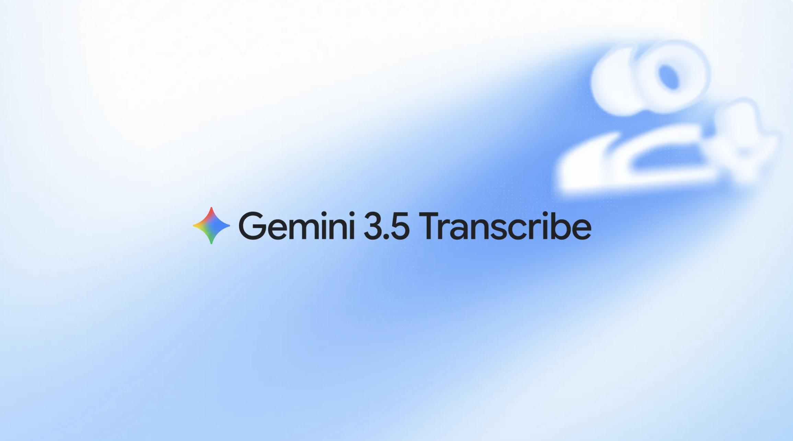
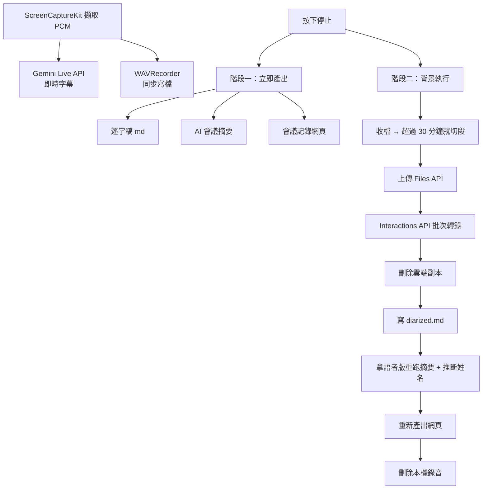

# 前情提要

我有一個自己在用的 macOS App，[gemini-live-translate-macos](https://github.com/kkdai/gemini-live-translate-macos)。它用 ScreenCaptureKit 直接抓指定 App 的音訊，不需要 BlackHole 那類虛擬音效卡，然後丟給 Gemini Live API 做即時翻譯，一邊出繁中字幕、一邊播中文語音。開發過程寫過兩篇，[第一篇](/agy-macos-app/)是用 AGY CLI 從零做出來，[第二篇](/agy-macos-app-enhance/)是 Claude Code 接力把它從能動變成好用。

這次要加的東西起點很單純：我看到 Live API 多了一份「即時逐字稿」的文件，想說既然已經在接 Live API 了，加個純逐字稿模式應該就是改幾個參數的事。

結果查完文件才發現，Google 這次一口氣放了**兩顆名字很像但能力差很多的模型**，而我真正想要的那個功能（語者分離）在我原本以為的那顆上面根本沒有。

---

# 兩個名字只差兩個字的模型

先把差異攤開，這是我花最多時間才搞清楚的部分：

| | `gemini-3.5-transcribe-live` | `gemini-3.5-transcribe` |
|---|---|---|
| 走哪個 API | Live API（WebSocket 串流） | Interactions API（一般 HTTP 請求） |
| 使用情境 | 邊講邊出字 | 錄完之後整份丟進去 |
| 語者分離 | 不支援 | 最多 8 位 |
| 字詞層級時間戳 | 不支援 | 支援 |
| 音訊長度 | 單次 session 10 分鐘 | 1 小時，開語者分離時 30 分鐘 |
| 智慧模式 | `SMART` 可用 | `smart` 與語者分離互斥 |
| 暫定字幕 | 有 `interimInputTranscription` | 不適用 |

官方文件在 Live 那頁的限制章節寫得很直白：

> Speaker diarization is not supported in live streaming sessions. For speaker diarization, use the non-streaming Audio transcription endpoint.

所以「即時看到誰在講什麼」這件事，目前做不到。要語者分離就得錄下來、會後整份送出去。這個限制決定了我後面整個架構。

## 即時那顆：interim 是它的重點

setup 的形狀跟原本的翻譯模型不一樣，`responseModalities` 要是 `TEXT`，轉錄參數放在 `setup.inputAudioTranscription` 底下：

```json
{
  "setup": {
    "model": "models/gemini-3.5-transcribe-live",
    "generationConfig": { "responseModalities": ["TEXT"] },
    "inputAudioTranscription": {
      "languageCodes": [],
      "mode": "SMART"
    },
    "realtimeInputConfig": {
      "automaticActivityDetection": { "disabled": false }
    }
  }
}
```

`languageCodes` 留空是自動偵測語言，填 `["en-US"]` 這種 BCP-47 代碼則是給它語言偏好。`mode` 有兩個值：`VERBATIM` 逐字保留所有內容，`SMART` 會拿掉 uh、um 這類填充詞並自動補上格式。會議記錄我選 `SMART`，讀起來乾淨很多。

還有一個 `customVocabulary` 可以塞專有名詞，上限 1000 條，但文件建議 100 條以內效果最好。這次我沒做，等真的遇到人名一直被聽錯再說。

回應端則多了一個原本翻譯模型沒有的欄位：

- `interimInputTranscription`：說話中的暫定結果，會被後面的內容覆蓋
- `inputTranscription`：說話者停頓或這一輪結束時的定稿

這個分野會影響 UI 怎麼寫，後面會講。

## 批次那顆：走的是完全不同的 API

這是最容易踩空的地方。`gemini-3.5-transcribe` 不是打 `generateContent`，而是 Interactions API：

```json
POST https://generativelanguage.googleapis.com/v1beta/interactions

{
  "model": "gemini-3.5-transcribe",
  "input": [
    { "type": "audio", "uri": "YOUR_FILE_URI", "mime_type": "audio/wav" }
  ],
  "generation_config": {
    "transcription_config": {
      "language_codes": [],
      "mode": {
        "type": "verbatim",
        "diarization_mode": "speaker",
        "timestamp_granularities": ["word"]
      }
    }
  }
}
```

`diarization_mode: "speaker"` 就是語者分離的開關，但它只能配 `verbatim`。也就是說：**想要語者分離，就得放棄 SMART 模式去贅詞的好處**，兩個不能同時要。

那個 `timestamp_granularities` 我一開始沒寫，因為文件的簡短範例裡沒有它。少了它整個功能會安靜地失效，過程寫在最後一節。

音訊要先上傳到 Files API 換一個 file URI 再帶進請求裡，官方文件沒有給 base64 內嵌的範例。回應則是這樣：

```json
{
  "steps": [{
    "type": "model_output",
    "content": [{
      "type": "text",
      "text": "Hello world",
      "annotations": [
        { "type": "word_info", "text": "Hello", "speaker": "spk_1",
          "start_offset": "0.100s", "end_offset": "0.450s" }
      ]
    }]
  }]
}
```

語者標籤在**字詞層級**的 annotations 裡，是 `spk_1`、`spk_2` 這種代號，模型不知道誰是誰。文件另外註明最多 8 位講者，而且「3 人以上的歸屬屬於實驗性質」。

---

# 第一階段：把純逐字稿模式加進 App


這部分比我預期的簡單，因為 App 原本就在解析 `inputTranscription` 跟 `outputTranscription`（翻譯模型本來就會回這兩個，用來做中英雙語字幕）。真正要動的是模式的分岔。

原本的連線層是這樣判斷的：

```swift
let isTranslateModel = modelName.contains("live-translate")
```

一個布林值分兩條路。現在要三條，就換成 enum：

```swift
enum LiveMode {
    case translate    // gemini-*-live-translate-*：輸出翻譯語音 + 雙語字幕
    case transcribe   // gemini-*-transcribe-live：只出文字
    case general      // 其他 Live 模型：靠 systemInstruction 做口譯

    static func from(modelName: String) -> LiveMode {
        if modelName.contains("transcribe") { return .transcribe }
        if modelName.contains("live-translate") { return .translate }
        return .general
    }
}
```

順手把 setup config 的產生跟伺服器回應的解析從 `GeminiLiveConnection` 裡抽出來變成純函式。這支檔案本來就有點肥，抽完之後淨減了六十幾行，而且抽出來的東西可以直接測。

## 一個預防性的取捨：重覆的字

解析回應時我做了一個決定，值得記一下。轉錄模型除了 `inputTranscription` 之外，`modelTurn` 的 parts 也可能帶同一段文字。如果兩邊都收，同一句話會在字幕跟匯出檔裡出現兩次。

老實說我**沒有實際看到這個狀況發生**，是讀文件跟舊程式碼時發現兩條路都會走到 `didReceiveOutputTranscription`，覺得有風險才擋掉的：

```swift
// 純逐字稿模式的內容已經由 inputTranscription 提供，
// 再收 modelTurn 的文字會讓同一句話重覆出現。
if mode != .transcribe,
   let text = part["text"] as? String, !text.isEmpty {
    events.append(.outputTranscription(text))
}
```

這種預防性的防禦有個壞處：如果實際上不會發生，這行就是永遠不會生效的死碼，而且沒人知道。所以我把它寫成一條測試（「transcribe 模式忽略 modelTurn 文字」），至少行為是被鎖住的、意圖是被寫下來的。

## 沒有測試框架的專案，怎麼跑測試

這個專案沒有用 Xcode 專案檔，是一支 `build_app.sh` 直接呼叫 `swiftc` 把所有 `.swift` 編成 `.app`。沒有 SwiftPM，也就沒有 `swift test`，沒有 XCTest。

我的解法是同一招再用一次：既然抽出來的都是純函式，就寫一支 `main.swift` 當斷言 runner，跟那些純函式一起編成執行檔，用離開碼判斷成敗。

```bash
swiftc -sdk "$SDK_PATH" -target "${ARCH}-apple-macos13.0" \
  -o "${BUILD_DIR}/run_tests" \
  LiveSetupConfig.swift TranscriptFormatter.swift \
  WAVRecorder.swift AudioChunker.swift \
  GeminiTranscribeService.swift GeminiSummaryService.swift \
  Tests/main.swift
```

斷言函式本身十行不到：

```swift
func checkEqual<T: Equatable>(_ actual: T?, _ expected: T, _ name: String) {
    if actual == expected {
        passedCount += 1
    } else {
        failures.append("\(name)（實際：\(String(describing: actual))，預期：\(expected)）")
    }
}
```

這當然比不上真正的測試框架，沒有 setup/teardown、沒有平行執行、失敗了不會告訴你在第幾行。但它能跑、能擋回歸，而且不需要為了測試把整個專案改成 SwiftPM。這一階段結束時是 37 條斷言，做完語者分離變成 98 條。

---

# 第二階段：語者分離要動的東西比想像多

「加一個語者分離」聽起來像是多打一支 API，實際上要多做三件事：把音訊落地成檔案、上傳、然後接一條完全不同的 API。而且因為批次轉錄可能要跑好幾分鐘，它不能卡在原本的停止流程裡。

最後的資料流長這樣：



分成兩階段是刻意的。階段二的每一步都可能斷（上傳逾時、配額用完、回應格式跟文件不一樣），如果把它接在原本的流程中間，一失敗連原本好好的逐字稿跟摘要都拿不到。現在的作法是階段一完全不動，階段二只在後面追加，失敗就只是少一份產出。

錄音格式也是撿現成的：送給 Live API 的音訊本來就已經被重採樣成 16kHz 單聲道 16-bit PCM，直接把同一份資料多寫一份到磁碟就是合法的 WAV 內容，補個 44 bytes 的檔頭就好，完全不需要重新編碼。

同樣的防禦心態也用在解析上：`parseDiarized` 對回應結構的假設是照文件寫的，如果實際格式有出入，我留了一條退路——抓不到字詞標註時退回整段 `output_text`，至少逐字稿不會整個空掉。這條退路後來確實派上用場了，只是方式跟我想的不太一樣，最後一節會講。

---

# 重大踩坑與解決方案

## 踩坑一：切段不能「切滿 30 分鐘再留零頭」

開語者分離的音訊上限是 30 分鐘，但會議常常一小時起跳，所以要切段。

我第一版的想法是最直覺的那種：切滿 30 分鐘算一段，剩下的當最後一段。寫測試的時候才發現這個做法有兩個洞。

一場 60 分 5 秒的會議，會切成 30 分、30 分、5 秒三段。那 5 秒的尾巴送去轉錄毫無意義，還要多付一次上傳跟一次 API 呼叫。那把尾巴併進前一段？併完那段就變成 30 分 5 秒，**超過 API 上限**，整段被打回來。

**原因與解法**：改成平均切分。先算出需要幾段（無條件進位），再把總長度平均分配：

```swift
let count = (usable + maxChunkBytes - 1) / maxChunkBytes
guard count > 1 else { return [0..<usable] }

var ranges: [Range<Int>] = []
var start = 0
for index in 1...count {
    var end = usable * index / count
    end -= end % blockAlign      // 對齊 16-bit 取樣邊界
    if index == count { end = usable }
    ranges.append(start..<end)
    start = end
}
```

60 分 5 秒變成兩段各 30 分 2.5 秒？不對，會超過。實際上是 `ceil(3605 / 1800) = 3`，切成三段各 20 分鐘。永遠不會有零頭段，也永遠不會超過上限。

那個 `end -= end % blockAlign` 也是必要的。16-bit 單聲道每個取樣佔 2 bytes，如果切在奇數位元組上，後面整段音訊的位元組會全部錯開一格，播出來是噪音。

## 踩坑二：第 2 段的 spk_1 不是第 1 段的 spk_1

切段之後才想到的問題。每一段都是獨立的一次 API 呼叫，模型不知道前一段發生過什麼事，所以第 2 段標出來的 `spk_1` 跟第 1 段的 `spk_1` 完全沒有關係，可能是不同人。

如果直接把三段接起來輸出，讀的人會很自然地以為 `spk_1` 從頭到尾都是同一個人。這比沒有語者標籤還糟：**它給的是錯誤的確定感**。

**原因與解法**：只要切過段，就把段號併進代號，變成命名空間：

```swift
static func qualifiedLabel(chunkIndex: Int, chunkCount: Int, speaker: String) -> String {
    guard chunkCount > 1 else { return speaker }
    return "第\(chunkIndex + 1)段-\(speaker)"
}
```

匯出時在段落交界處插一行說明：

```markdown
---

> 第 2 段（語者代號與前一段不互通）
```

這套代號同時也是後面丟給 AI 做姓名推斷的那份文字用的代號。兩邊共用同一套詞彙，模型才有機會透過名字把跨段的同一個人接回來——如果第 1 段跟第 3 段都有人被叫「Evan」，它可以各自對應，而不是被迫假設代號相同。

## 踩坑三：字詞接起來變成「你 好 世 界」

批次 API 回的是**字詞層級**的標註，要自己接成句子。英文很直覺，用空格接。

問題是中文。Gemini 回的中文 token 接上空格之後會變成「你好 世界 我們 今天」，看起來像斷詞練習。

**原因與解法**：接字的時候看兩邊的字元屬性，任一邊是中日韓文字就不加空格；標點符號前面也不加：

```swift
private static func needsSpace(after previous: Character, before next: Character) -> Bool {
    if isCJK(previous) || isCJK(next) { return false }
    if next.isPunctuation { return false }
    return true
}
```

`isCJK` 是查 Unicode 區段，涵蓋 CJK 統一表意文字、假名、韓文、全形字元那幾塊。

標點那條是後來補的。原本只擋 CJK，測試 `["Hello", ",", "world"]` 的時候才發現會變成 `Hello , world`。這種東西不寫測試根本不會發現，因為它不會壞、只是有點醜。

## 踩坑四：兩個非同步流程搶著寫同一份摘要

階段一停止後會產生一次 AI 會議摘要，階段二拿到語者版逐字稿之後會再產生一次（這次帶語者資訊，待辦事項的「負責人」欄位才有東西可以填）。

正常情況下階段二一定比較慢——它要上傳一百多 MB 的音訊再等轉錄。但「正常情況下比較慢」不是保證。如果階段一的摘要 API 剛好卡住重試，而階段二的音訊只有一分鐘、很快就跑完，順序就會反過來，階段一晚回來的舊摘要會把語者版的結果蓋掉。

**原因與解法**：階段二在寫入之前先等階段一結束：

```swift
// 等階段一的摘要落地，否則它可能在我們之後才回來，把語者版的結果蓋掉
await minutesTask?.value
guard !Task.isCancelled else { return }
```

一行的事，但要先想到「這兩件事其實沒有順序保證」。這種 race 幾乎不會在測試中出現，只會在某個網路特別差的日子裡讓使用者拿到一份莫名其妙變回舊版的會議記錄。

## 踩坑五：TDD 的 RED 階段，測試自己崩潰了

寫 WAV 檔頭的測試時我照 TDD 的規矩先寫測試、建一個回傳空 `Data()` 的 stub，然後跑起來看它失敗。結果不是失敗，是整支測試程式當場掛掉：

```
Swift/arm64e-apple-macos.swiftinterface:41299: Fatal error:
UnsafeRawBufferPointer.load out of bounds
Trace/BPT trap: 5
```

我的測試會去讀第 24 個位元組檢查取樣率是不是 16000，但 stub 回的是空的 `Data`，讀出界了。

**原因與解法**：讀之前先補零：

```swift
let produced = WAVRecorder.header(dataByteCount: 64000)
checkEqual(produced.count, 44, "WAV 檔頭為 44 bytes")

// 長度不足時補零再讀，讓後續每個欄位都能各自回報失敗而不是整支測試崩掉
let header = produced + Data(repeating: 0, count: max(0, 44 - produced.count))
```

這件事本身是小事，但它讓我看到一個平常不會注意的問題：**測試程式本身也要能承受被測物完全壞掉的情況。** 如果一個測試在 RED 階段是用崩潰收場而不是回報失敗，那你只知道「有東西壞了」，不知道是哪十二個欄位分別錯在哪。補完零之後，同一次執行就把十二個欄位的預期值全部列出來，實作的時候是照著清單填，不是猜。

## 踩坑六：捲動錨點在新模式下失效

即時逐字稿模式跟翻譯模式有個結構差異：翻譯模式會把字一個個累積到「當前這句」，湊到標點才推進歷史；而轉錄模式的每一則 `inputTranscription` 本身就是一句定稿，直接進歷史就好。

原本的自動捲動是這樣寫的：

```swift
proxy.scrollTo("currentLine", anchor: .bottom)
```

`currentLine` 這個 id 掛在「當前這句」的顯示區塊上。在逐字稿模式下，句子一定稿就進歷史，那個區塊隨即消失——捲動的目標不存在了，畫面就停在原地不動。

**原因與解法**：改用一個永遠存在的底部錨點：

```swift
Color.clear
    .frame(height: 1)
    .id("bottomAnchor")
```

這個 bug 沒有錯誤訊息、沒有崩潰，就只是「新加的功能捲不下去」，而且要有足夠多的內容超出畫面才看得出來。我是在讀 view 的條件分支時發現的，不是跑出來的。

## 踩坑七：讓 AI 猜名字，重點是擋住它亂猜

拿到 `spk_1`、`spk_2` 之後，最想做的當然是把代號換成真名。而這件事其實可行——會議裡常常有「Evan 你那邊進度如何」「我是 Sarah，負責前端」這種線索，把帶標籤的逐字稿丟給模型，它看得到就能對上。

但這正是最容易生出幻覺的地方。模型很樂意從語氣、職務內容、發言比重「推理」出一個名字給你，而那個名字會以完全相同的自信度出現在會議記錄裡。

**原因與解法**：三個手段一起上。

第一，schema 明確允許 null，並要求附上判斷依據：

```swift
properties["speakers"] = [
    "type": "ARRAY",
    "items": [
        "type": "OBJECT",
        "properties": [
            "label": ["type": "STRING"],
            // 找不到線索時必須回 null，而不是硬湊一個名字
            "name": ["type": "STRING", "nullable": true],
            "evidence": ["type": "STRING", "nullable": true]
        ],
        "required": ["label"]
    ]
]
```

第二，prompt 把規則講死：

> 只有在逐字稿或會議筆記中出現明確的稱呼、點名或自我介紹時才填 name，並在 evidence 說明是哪一句讓你這樣判斷。不要從語氣、職務內容或發言比重臆測姓名。找不到明確線索時，name 與 evidence 一律回 null。

第三，**砍掉信心分數**。我原本設計了一個 `confidence` 欄位，後來拿掉了。理由是模型自評信心值本來就不可靠，而 `evidence` 已經完整承擔了這個角色：有證據就是推斷成功，沒證據就是沒推斷出來。多一個信心分數只會讓人以為它比實際上更可信——「這裡寫 0.7 耶，那應該有七成準吧」，但那個 0.7 不是從任何真實的機率分佈來的。

輸出長這樣，推斷成功的附上依據，推斷不出來的老實承認：

```markdown
## 與會者
- **Evan**（spk_1）— 依據：第 3 段被稱呼「Evan 你那邊進度如何」
- spk_2 — 逐字稿與筆記中沒有足夠線索指出姓名
```

代號留在括號裡也是刻意的。看到 `**Evan（spk_1）**` 你會知道這是推斷來的、對不上時可以自己核對；如果直接寫成 `**Evan**`，它看起來就跟事實一樣了。

另外一個加分的線索來源：我把使用者當場寫的會議筆記也一起送進去。筆記裡常常已經有與會者名單，對應成功率會高不少。但這裡要加一道防線——prompt 必須說清楚「筆記只能用來對應語者姓名，不可以把筆記內容當成有人說過的話寫進摘要或待辦事項」，不然你自己寫的備忘錄會變成某人的發言。

---

# 隱私與清理：不要留下你不想留的東西

批次轉錄天生比即時串流多了兩份資料：本機的錄音檔，跟上傳到 Google 的那份副本。這兩份都要有明確的下場。

- **錄音檔只在勾選時才產生。** 沒開語者分離就完全不寫檔，硬碟上不會有任何東西。
- **轉錄成功就刪掉本機錄音。** 一小時的會議大約 115MB，累積起來很可觀。
- **失敗時反而保留。** 這是刻意的例外：轉錄失敗時錄音檔留著，狀態列會告訴你路徑，讓你能重試或自己處理。此時刪掉才是真的丟資料。
- **雲端副本用完立刻刪除。** Files API 的檔案會存 48 小時自動過期，但「反正它會自己消失」跟「我確定它現在已經不在了」是兩件事。

```swift
// 用完立刻把雲端副本刪掉，不留著等 48 小時自動過期
await GeminiFilesUploader.delete(apiKey: apiKey, name: uploaded.name)
```

---

# 成果與效益

兩個階段加起來的數字：

| | 純逐字稿模式 | 語者分離 | 實測後的修正 |
|---|---|---|---|
| 新增檔案 | 2 | 4 | 0 |
| 累計測試斷言 | 37 | 98 | 108 |
| commit | [`b0e12c5`](https://github.com/kkdai/gemini-live-translate-macos/commit/b0e12c5) | [`486ba8f`](https://github.com/kkdai/gemini-live-translate-macos/commit/486ba8f) | [`686899a`](https://github.com/kkdai/gemini-live-translate-macos/commit/686899a)、[`1cc41c3`](https://github.com/kkdai/gemini-live-translate-macos/commit/1cc41c3) |

`GeminiLiveConnection.swift` 這支原本什麼都做的檔案，setup 產生跟回應解析都被抽走之後淨減了六十幾行，而且抽出來的兩個純函式模組現在有 20 幾條測試守著。這是這次的意外收穫：**為了讓東西可測而做的拆分，本身就是我拖了很久沒做的重構。**

**要先確認你想要的功能在哪顆模型上。** 我一開始理所當然地以為「即時逐字稿」那顆會有語者分離——都是轉錄模型，差別只在即時與否嘛。查了文件才發現不是，而且這個差異不是參數開關，是架構層級的：要語者分離就得錄檔、上傳、走另一條 API、接受 30 分鐘上限、放棄 SMART 模式。如果我沒先查就開始寫，會在「改幾個參數」的心理預期下撞上一整套新的子系統。

**限制往往決定架構。** 這次每一個設計決定幾乎都是被限制逼出來的：30 分鐘上限逼出切段、切段逼出代號命名空間、批次很慢逼出兩階段匯出、`smart` 與 `diarization` 互斥逼我在乾淨的逐字稿跟語者標籤之間二選一。先把限制查清楚再開始設計，比先設計再撞牆省事得多。

**即時逐字稿那半邊已經實跑過了。** 上面那張截圖就是拿日文影片餵進去的結果，`gemini-3.5-transcribe-live` 自動偵測到日文、直接輸出日文逐字稿，中間沒有經過翻譯，停止後也照常吐出會議記錄網頁。`languageCodes` 留空的自動偵測是真的能用。

**語者分離那半邊實跑之後出事了**，而且是我沒預料到的方式：檔案有產生、逐字稿內容正確、程式一個錯都沒報，就是沒有分人。這一段值得單獨講，寫在下一節。

---

# 後記：文件的範例會給你一份不報錯的空結果

發文之後我拿一場真的對話跑了語者分離。`meeting-2026-08-28-11-54-diarized.md` 有產生、內容完整、一個字都沒少，但從頭到尾沒有任何語者標籤，就是一整段連在一起的文字。

沒有錯誤訊息，狀態列顯示成功，檔案該有的都有。這種失敗最難查，因為它看起來就像成功。

## 先做一個能自己重現的最小案例

第一個問題是我手上沒有證據——App 沒有把原始回應存下來，那場會議的錄音也因為「轉錄成功」被自動刪掉了。要重跑就得再開一場會議，而且不保證重現。

所以我沒有去猜哪裡壞了，而是先想辦法拿到一份原始回應。macOS 內建的 `say` 可以指定不同的聲音，那就用它合成一段兩個人的對話：

```bash
say -v Alex     -o a1.aiff "Hi Samantha, did you finish the quarterly report yesterday?"
say -v Samantha -o a2.aiff "Yes Alex, I sent it to the whole team this morning."
say -v Alex     -o a3.aiff "Sure, I will look at the budget section this afternoon."

for f in a1 a2 a3; do afconvert -f WAVE -d LEI16@16000 -c 1 $f.aiff $f.wav; done
```

三段接起來是 17 秒、兩位語者、格式跟 App 錄出來的一模一樣（16kHz 單聲道 16-bit）。接著用 curl 走完整條上傳與轉錄，把 JSON 整份倒出來。

這一步花不到五分鐘，但它把「要再開一場會議、跑十幾分鐘、還不確定會不會重現」變成「改一個欄位、跑十秒、立刻看到差別」。**能重現的最小案例值得先花時間做**，尤其當原本的重現路徑很貴的時候。

倒出來的回應長這樣：

```json
{
  "steps": [{
    "content": [{ "text": "Hi Samantha, did you finish...", "type": "text" }],
    "type": "model_output"
  }]
}
```

811 bytes，完整的逐字稿，**一個 annotation 都沒有**。所以問題不在我的解析，在請求。

## 根因一：字詞層級標註要自己開，不開就什麼都沒有

同一個音檔、同一個上傳的檔案，只改請求裡的一個欄位：

| 請求內容 | 回應中帶 `speaker` 的物件 |
|---|---:|
| 只有 `diarization_mode: "speaker"` | 0 |
| 拿掉 `language_codes: []` | 0 |
| 加上 `timestamp_granularities: ["word"]` | **41** |

語者代號是掛在 `word_info` 標註上的，而字詞層級標註要在請求裡明確要求才會回傳。沒要求，就沒有標註；沒有標註，就沒有語者。

我原本沒寫這個欄位，是因為照著文件裡那段最短的 Python 範例抄的——那個範例只有 `type` 跟 `diarization_mode`。文件另一處的完整 REST 範例其實是有 `timestamp_granularities` 的，但我當時已經「知道」該怎麼寫了，就沒再回頭看。

最難受的是**它不報錯**。API 回 200、給你完整的逐字稿、`status` 是 `completed`。如果它回一個「你要求語者分離但沒開字詞標註」的錯誤，我五分鐘就修好了。

## 根因二：實際的代號格式跟文件不一樣

加上欄位之後 annotations 出現了，但長得跟我以為的不一樣：

```json
{"text":"Hi,","start_offset":"0.100s","end_offset":"0.500s","speaker":"spk:0","type":"word_info"}
```

`spk:0`。**冒號，而且從 0 開始。** 文件從頭到尾寫的都是 `spk_1`、`spk_2`。

而我的顯示邏輯是這樣寫的：

```swift
if let range = speaker.range(of: "spk_"), let number = Int(speaker[range.upperBound...]) {
    return "語者 \(number)"
}
return speaker   // ← 比不到就把原始代號印出來
```

`spk:0` 比不到 `spk_`，於是直接掉進 fallback，畫面上會出現 `**spk:0**：`。

這個 bug 我的測試完全抓不到，原因很簡單：**測試資料是照文件寫的。** 文件錯了，測試就跟著錯，然後綠燈告訴我一切正常。這是我這次最想記下來的一點——對外部 API 的測試，你測的其實是「我對這個 API 的理解」，不是 API 本身。理解錯了，測試只會忠實地保護那個錯誤。

修法我沒有把 `spk_` 改成 `spk:`，那只是把賭注換一個方向下。改成不解析代號裡的數字，用語者在該段落中第一次出現的順序來編號：

```swift
/// 代號的實際格式由 API 決定（實測回傳 spk:0、spk:1，官方文件寫的則是 spk_1），
/// 所以不去解析代號裡的數字，改用它在這一段裡第一次出現的順序來編號。
static func speakerOrder(in chunk: [DiarizedSegment]) -> [String: Int] {
    var order: [String: Int] = [:]
    for segment in chunk where !segment.speaker.isEmpty {
        if order[segment.speaker] == nil {
            order[segment.speaker] = order.count + 1
        }
    }
    return order
}
```

格式再變也不會壞，因為它根本不看格式。

## 我自己寫的退路，讓失敗看起來像成功

前面我寫過這段，當時還挺滿意的：

> `parseDiarized` 對回應結構的假設是照文件寫的，如果實際格式有出入，我留了一條退路——抓不到字詞標註時退回整段 `output_text`，至少逐字稿不會整個空掉。

這條退路確實生效了，效果也如預期：使用者拿到一份完整的逐字稿，沒有東西遺失。

但它同時也**把失敗藏起來了**。如果沒有那條退路，`-diarized.md` 會是空的或根本不會產生，我立刻就知道有事。有了它，我拿到的是一份看起來很正常、只是少了我要的那個功能的檔案——而那個功能正是我開這個功能的唯一理由。

這裡的分寸我還沒完全想清楚。降級處理本身沒有錯，錯的是**降級之後沒有講出來**。現在的作法是退路保留，但在退路被觸發時把狀態列訊息換掉，明講「這次沒有取得語者資訊」，而不是照常顯示「語者逐字稿已儲存」。

## 修完之後

拿真實回應跑完整條解析，Alex 講的兩段都正確回到語者 1：

```
**語者 1**：Hi, Samantha. Did you finish the quarterly report yesterday?
**語者 2**：Yes, Alex. I sent it to the whole team this morning. Could you review the budget section?
**語者 1**：Sure. I will look at the budget section this afternoon and get back to you.
```

語者分離本身的品質是好的。測試從 98 條加到 106 條，多的四條就是這兩個根因的回歸測試——這次的測試資料不是照文件抄的，是從真實回應剪下來的。

順帶三個實測才知道的細節：

- REST 端點只吃 snake_case，送 `generationConfig` 會被明確退回 `Unknown parameter 'generationConfig'. Did you mean 'generation_config'?`。這個錯誤報得很好，比上面那個安靜的失敗有用一百倍。
- annotations 帶了 `start_index` 與 `end_index`，直接對應到 `content.text` 裡的位置。用它來切字串會比我那套中英文接字的啟發式準得多，等於整個 `joinWords` 都可以拿掉。這個我還沒動。
- 上傳的檔案 `state` 直接就是 `ACTIVE`，17 秒的音訊沒有經過 `PROCESSING` 階段。我原本寫了輪詢等待的邏輯，看來對短音訊是多餘的，但長音訊會不會需要還不知道，先留著。

**這篇文章因此有了兩段結尾，我決定兩段都留著。** 前面那段寫「語者分離還沒驗到，等我跑過再回來補」，然後我真的跑了，然後它壞了。如果我把前面那段改掉、只留修好之後的版本，這篇就會變成一篇很順的「我做了 X，它成功了」——而實際發生的事情是「我照文件做了 X，它安靜地失敗了，我花了半小時才知道為什麼」。後面這個對讀者有用得多。

程式碼在 [kkdai/gemini-live-translate-macos](https://github.com/kkdai/gemini-live-translate-macos)。兩份官方文件分別是 [Live transcription](https://ai.google.dev/gemini-api/docs/live-api/live-transcribe) 跟 [Audio transcription](https://ai.google.dev/gemini-api/docs/transcribe)，語者分離那頁的限制章節建議連著讀完再動手。
