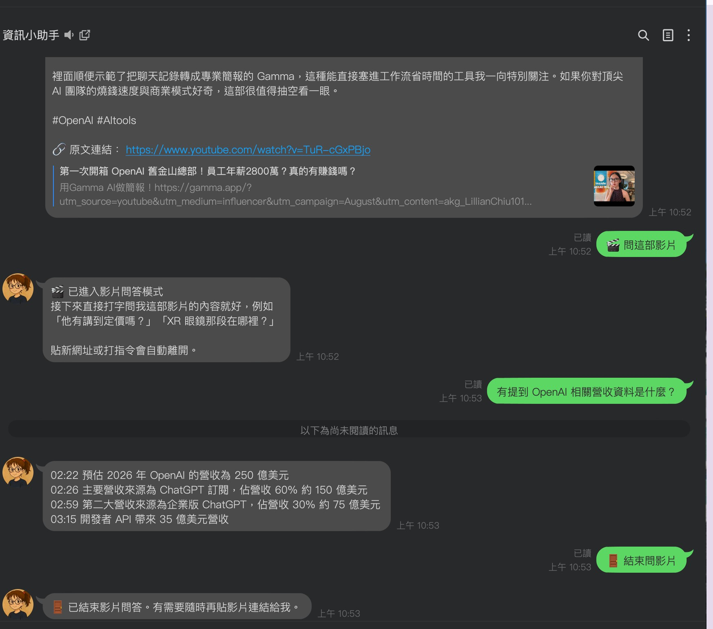
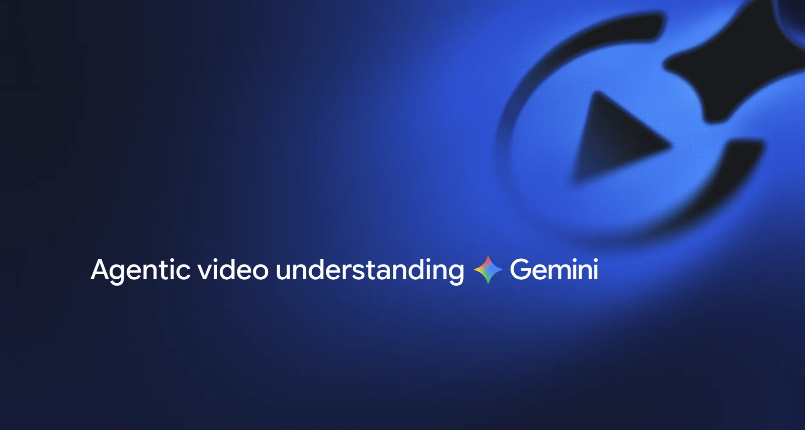

# 前情提要

我有一個自己每天在用的 LINE Bot，[linebot-helper-python](https://github.com/kkdai/linebot-helper-python)。丟網址給它會回摘要跟四個平台的社群文案，丟 YouTube 連結會回影片摘要，還有書籤、地點查詢、語音助理那些。跑在 Cloud Run 上，用 Vertex AI。

八月底 Google 發了一篇 [Introducing agentic video in Gemini](https://blog.google/innovation-and-ai/models-and-research/gemini-models/introducing-agentic-video-in-gemini/)，看完我第一個念頭是：這東西能讓我的 bot 多做一件現在做不到的事——**針對影片提問**，而不是只給一份摘要。

結果做下來，公告裡沒寫的部分比寫了的更值得記。

---

# Agentic video 是什麼



原本 Gemini 讀影片是「靜態」的：不管你問什麼，它都照固定的取樣率把整支影片的每一格畫面、每一段音訊全部塞進 context。一支兩小時的影片，光影片本身就佔掉幾十萬 token，而你可能只是想問「他有講到定價嗎」。

Agentic 模式把這件事反過來：讓模型自己決定要載入哪一段。先掃逐字稿，判斷答案可能在 1:24 附近，就只把那一段的畫面拉進來。

官方公告給的數字是長片場景 token 少 88%、成本降 66%、正確率高 7%。開啟方式就是在 Part 上多一個參數：

```python
video_part = types.Part(
    file_data=types.FileData(file_uri=..., mime_type="video/mp4"),
    media_processing="AGENTIC",   # 或 "STATIC"
)
```

支援的模型有三個：`gemini-3.7-flash`、`gemini-3.6-flash`、`gemini-3.5-flash-lite`。輸入來源可以是 YouTube 網址、Cloud Storage URI，或內嵌的 base64。

## 它實際能做到什麼

我拿兩小時的 Google I/O '25 keynote 測，問「他有講到定價嗎？如果有，請給我幾分幾秒」，回來的是：

> 影片中有提到價格與訂閱方案的定價相關資訊。主要出現在影片的 **1:24:40 到 1:26:10** 左右⋯⋯

然後正確描述了 Google AI Pro 與 Google AI Ultra 兩個方案的差異。再問 Android XR 眼鏡那段在哪，回 `1:36:31 至 1:50:30`，內容也對得上。

這種在兩小時影片裡精準定位的能力，是我覺得這個功能真正值錢的地方。摘要人人都會做，「這支長片裡他哪時候講到 X」目前沒什麼工具做得好。

---

# 前置條件：四個參數，少一個都不會報錯

這是這次最貴的一課，所以放前面講。

在 Vertex AI 上要讓 agentic 真的生效，**四件事必須同時成立**：

| # | 條件 | 少了會怎樣 |
|---|---|---|
| 1 | `api_version="v1beta1"` | agentic 只在 v1beta1 提供，用 `v1` 會靜默退回 STATIC |
| 2 | `media_processing="AGENTIC"` | 預設就是 STATIC，不設等於沒開 |
| 3 | 模型在支援名單內 | 不支援的模型會靜默降級為 STATIC |
| 4 | `thinking_level` 有設定 | 見下一節，這個最麻煩 |

關鍵字是**靜默**。少任何一個，API 都會回 200、答案照樣產出、看起來完全正常，只有帳單不一樣。沒有任何錯誤訊息會告訴你 agentic 沒生效。

還有兩個環境面的前提：

- **SDK 版本**：`media_processing` 這個欄位是 `google-genai` **2.20.0** 才加進去的。我逐版下載驗證過，2.19.0 沒有、2.20.0 有。版本太舊的話這個參數會被當成未知欄位丟掉，一樣不報錯。
- **Vertex 專屬**：官方文件的多輪對話範例是寫給 Gemini Developer API 的，Vertex 這條路上行為不同，後面會講。

我的作法是把這四項各寫一支測試，斷言送進 SDK 的參數：

```python
def test_thinking_level_is_low(captured):
    youtube_tool.summarize_youtube_video(VIDEO_URL)
    config = captured["call_kwargs"]["config"]
    assert config.thinking_config is not None
    assert str(config.thinking_config.thinking_level).upper().endswith("LOW")
```

這四支測試存在的唯一理由，就是「這四件事錯了，程式照跑、答案照出，只有成本默默變動」。這種 bug 靠人工 review 抓不到。

---

# 踩坑一：Vertex AI 上留不住影片 context

我原本的設計是這樣：使用者貼連結拿到摘要，按「問這部影片」進入問答模式，之後每次追問都沿用上一輪的 context，不用重跑影片。

官方文件確實這樣寫：回應會帶 `tool_call` / `tool_response` parts，把它們原樣放回 history，下一輪就不用重新處理影片。

實測結果是拿不到。

Vertex 回的 parts 裡只有光禿禿的 `thought_signature`，沒有 `tool_call` 也沒有 `tool_response`。把 history 傳回去：

```
400 INVALID_ARGUMENT: Invalid thought signature.
```

我試了三種序列化方式，全部失敗。然後試了**完全不序列化、直接把 response 物件傳回去**，一樣失敗。所以問題不在我的序列化，在平台。

把 `thinking_level` 設成 `LOW` 之後不報錯了，但第二輪的 `tool_use_prompt_token_count` 是 **2,163**，跟第一輪的 **2,163** 一模一樣。影片被完整重跑了一遍，context 一點都沒留下。

**原因與解法**：那套多輪機制是寫給 Gemini Developer API 的。既然 Vertex 上保不住，就別假裝保得住：改成 stateless 重新查詢，每次提問都是獨立的一次呼叫。

這個決定讓實作反而變簡單了：不用序列化 history、不用處理 thought signature、session 只要存「這個使用者現在在問哪支影片」三個欄位。原本規劃要做的複雜版本直接被砍掉。

順帶一提，我原本擔心的「history 序列化會不會超過 Firestore 單文件 1 MiB 上限」，實測只有 1.5–7 KiB，**從頭到尾都不是問題**。花時間擔心的地方跟真正出事的地方經常不是同一個。

---

# 踩坑二：thinking token 才是成本主角，而且擋不住

這一坑我修正了三次因果推論才搞對，過程比結論有意思。

## 第一版結論（錯的）

最初的 spike，同一支 10 分鐘影片：

| 模式 | in | out（含 thinking） | 成本 |
|---|---|---|---|
| STATIC | 54,546 | 291 | $0.0171 |
| AGENTIC，未設 thinking_level | 2,216 | 37,574 | $0.0946 |
| AGENTIC + `thinking_level="LOW"` | 2,216 | 638 | $0.0023 |

看起來很清楚：agentic 把影片從 input 拿掉了（54,546 → 2,216），但模型改用「思考」去導航，而 **thinking token 按 output 計價**（$2.50/M，是 input 的 8.3 倍）。所以不設 `thinking_level` 反而比 static 貴 5.5 倍，設了就便宜 7.4 倍。

然後我拿兩小時的影片跑，同樣設 `LOW`，thinking token 是 **359,961**，單次 $0.91。

我的結論是：「長片上 `thinking_level` 會被忽略」。

## 第二版結論（也是錯的）

實作階段，負責那個 task 的 agent 照我要求跑了驗證，撞到門檻停下來回報：同一支影片、同一組設定，連續五次的 thinking token 是

```
0, 0, 34911, 35122, 37410
```

它還去撈了 DEBUG log，確認每一次送出的請求都確實帶著 `v1beta1` + `AGENTIC` + `thinking_level=LOW`，不是客戶端漏設。

所以不是影片長度——**我每個設定只跑一次，把抽樣雜訊當成了因果關係**。

它提了一個假說：可能跟 prompt 複雜度有關，因為前面那批用的是一句話的短 prompt，而出事那批用的是正式版的長 prompt。合理，於是我讓它用正式 prompt 重測。

## 第三版（實際的樣子）

27 次呼叫，三種設定各 6 次加問答路徑各 3 次：

| 設定 | thinking 尖峰 | tool_use>0 | 平均成本 |
|---|---|---|---|
| `thinking_level="LOW"` | 0/6 | ✓ | $0.00146 |
| `thinking_budget=0` | 0/6 | ✓ | $0.00137 |
| 完全不設 | 0/6 | ✓ | $0.00137 |
| `STATIC` | 0/6 | **✗（=0）** | $0.01659 |

全部 0 尖峰。但先前用**同一組正式 prompt** 的那批，是 4 次中 3 次尖峰。

所以 prompt 複雜度也不是。三種客戶端設定的行為完全一樣，唯一的差別是**何時呼叫**。

**原因與解法**：這是伺服器端的非決定性，客戶端沒有任何槓桿能控制。順帶確認兩件事：`thinking_budget` 和 `thinking_level` 不能並用（server 直接回 400）；`STATIC` 是唯一決定性的選項，但它的 `tool_use_tokens` 是 0。那不是「同樣功能換一種穩定模式」，是把 agentic 整個關掉。

我的決定是維持 `thinking_level="LOW"`，並加一道警告 log：

```python
# 實測 thinking token 只有兩群：~0 或 ~35,000-37,000，中間沒有值。
# 成因是伺服器端非決定性，沒有任何客戶端設定能防。
THINKING_TOKENS_WARN_THRESHOLD = 5000
```

維持 LOW 不是因為它比較穩（並沒有），而是三種設定量測不出差異，換一個等於拿已驗證的行為去換沒驗證的。真正有價值的補強是把那個 60 倍的成本事件從隱形變成 Cloud Run log 裡能 grep 到的東西。擋不住，至少要看得見。

所以誠實的成本圖像是：**正常約 $0.0014 一次，尖峰約 60 倍，無法預測也無法預防**。公告說的「成本降 66%」在不尖峰時成立，尖峰時反過來。

`thinking_level` 這個參數在我的實作裡是**必填、沒有預設值**：

```python
def _generate_video(youtube_url: str, prompt: str, *, thinking_level: str) -> dict:
```

給它預設值就是給人漏掉的機會，而漏掉不會有任何徵兆。

---

# 接進 LINE Bot：功能長什麼樣

流程是這樣：

```
使用者貼 YouTube 連結
  → 收到摘要 + 社群文案（原有功能）
  → 多一顆「🎬 問這部影片」
  → 按下後直接打字問：「他有講到定價嗎？」
  → 回答帶時間戳
  → 貼新網址 → 自動離開影片模式
```

三個新模組，各自獨立可測：

- `tools/youtube_tool.py`（改）— 唯一跟 Gemini 影片 API 溝通的地方，四個必要參數集中在一個函式裡
- `services/video_qa.py`（新）— 記住「使用者 → 影片」，TTL 30 分鐘
- `services/usage_meter.py`（新）— 記錄每次呼叫的 token 與成本

`main.py` 只增加兩個接點：訊息攔截，跟一個 postback 分支。

## 判斷順序是行為契約

使用者在影片模式中打字，判斷順序是：

```
脫離條件檢查 → 配額檢查 → 呼叫 Gemini
```

**脫離判斷必須在配額判斷之前。** 使用者貼新網址想換主題，不該因為影片問答的配額用完而被擋。那是兩件不相干的事，順序寫反的話，人會困在一個每則訊息都被拒絕、又打不出去的模式裡。

這條有專屬測試，因為它是契約不是實作細節。

## 脫離模式用啟發式，不用 LLM

判斷使用者是否想離開影片模式，我用的是最笨的方法：訊息含網址、或以 `/` 開頭，就離開。

刻意不用 LLM 判斷意圖，因為那要在每則訊息上多打一次 Gemini，而誤判的代價很低（使用者再問一次就好）。不值得那個成本和延遲。

實作上有個細節值得記：這個判斷直接呼叫主路徑在用的同一個 `find_url()`。一開始我是自己寫一份 regex，審查時有人建議把它加寬去支援無 scheme 的網址（`www.youtube.com/...`）。我去查主路徑實際用什麼判斷，發現它的 regex 也抓不到：**單方面加寬只會製造分歧**：影片模式退出了，主路徑卻不當它是網址，使用者拿到一個沒用的聊天回覆取代一個沒用的影片回覆。

改成共用同一個函式之後，兩者永遠一致；日後 `find_url` 若被加寬，影片模式會自動跟上。

---

# 開發流程：用 subagent 分工，讓審查者去抓我的錯

這次我用 Claude Code 的 subagent 分工跑完整個實作：一個計畫拆成 8 個 task，每個 task 派一個全新的 agent 實作，做完再派另一個 agent 審查，我自己只做協調和裁決。

這個安排的好處在於**審查者沒有實作者的執念**。實作的 agent 剛寫完程式，很容易覺得自己寫的是對的；審查的 agent 拿到的只有 diff、需求文件和報告，沒有「我剛剛想了很久」的包袱。

實際抓到的東西，比我預期的有價值得多。

## 它們抓到我三次錯誤的因果推論

前面 thinking token 那一節的三個版本，第一次修正是實作的 agent 撞到我設的門檻停下來回報的（我在指示裡寫了「看到三萬以上就停下來，不要安靜 commit」，它照做了）。第二次是它自己提出 prompt 複雜度的假說並設計實驗排除掉。

第三次最有意思。我在改文件時，把被推翻的說法換成「`gemini-3.5-flash-lite` 是唯一成本穩定的模型」。審查的 agent 指出：那 27 次非決定性實驗**就是在 3.5-flash-lite 上跑的**，尖峰正是在它身上量到的，這句話跟它自己引用的段落直接矛盾。

我把一個沒根據的說法換成了另一個沒根據的說法，而且犯了三次（spec、設定檔註解、測試 docstring 各一次）。

## 它抓到一個八輪審查都漏掉的 Critical

最後的整支分支審查抓到一件事：**整個功能的入口按鈕根本不會顯示**。

按鈕掛在 carousel 訊息上，但後面又 append 了四則文字訊息。LINE 只渲染**最後一則**訊息的 quickReply，所以按鈕被埋掉了。使用者貼 YouTube 連結，會收到摘要跟四則文案，然後看不到任何按鈕。

八輪 task 審查全部放行，因為每一輪看到的都是「按鈕正確地掛在 carousel 上」，沒有人看到後面還會再加四則訊息。測試也漏掉了——那些測試直接呼叫 handler，跳過了訊息組裝那一段。

**這是單一 task 的審查在結構上看不到的東西**，只有把整條路徑攤開才看得見。

修完之後我又用突變測試驗證一次：把掛載搬回原本的位置，只有新加的多網址測試會紅，原本那支單一網址的測試照樣過，那正是它抓不到這個 bug 的原因。

## 我自己犯的錯

流程再好也擋不住我在指示裡寫錯東西：

- 我在設計文件和給 agent 的指示裡寫了「reply 失敗會改用 push」，還在對話中複述過兩次。實際上那個機制**不存在**：我把 docstring 裡描述「訊息溢位處理」的句子誤讀成「失敗回退」，從來沒去驗證。最後的整支審查抓到的。
- 我給的程式碼片段有 `UnboundLocalError`，變數只在某個分支賦值。實作的 agent 更正了。
- 我叫它把入口按鈕加在一個**不存在的地方**：那段 postback handler 是死碼，repo 裡沒有任何地方會產生對應的按鈕。它自己找到真正可達的路徑掛上去。
- 我要求「還原數值捨入」，沒先驗算它跟既有測試容差的關係，害那個 task 多繞一圈。實作的 agent 把數字算給我看，沒有自己選一邊做下去。

寫下來有點難看，但這些正是這套流程真正的產出：**每一個錯誤都在合併前被攔下來了**。

---

# 成果與效益

| | 數字 |
|---|---|
| commit | 18 |
| 測試 | 192 → 275 passed |
| 收斂的模型字面值 | 28 處 |
| 修好的線上故障 | 1（智慧對話 404） |
| 實測花費 | 約 6–8 美元（大部分在三輪成本量測上） |

順帶完成了 roadmap 上擱置很久的一項：token 與成本記錄。這件事原本是「有空再做」，做完 thinking token 那一坑之後變成必要配套：既然尖峰無法預防，至少要能事後看到它發生過。

## 幾個我會帶走的東西

**先查限制，再設計。** 這次幾乎每個設計決定都是被限制逼出來的：Vertex 留不住 context 逼出 stateless 查詢、thinking token 不可控逼出警告 log、`thinking_budget` 與 `thinking_level` 不能並用直接砍掉一個選項。先把限制查清楚再開始設計，比先設計再撞牆省事得多。

**單次觀測不是結論。** 我最貴的錯誤是拿一次觀測就下因果判斷，然後把那個判斷寫進設計文件，再由文件擴散到程式碼註解、環境變數說明、決策紀錄。等到發現它是錯的，光是把殘留清乾淨就花了三輪——而且中間還兩度產生新的錯誤說法。推翻一個結論比建立它費工得多。

**測試守的是 bug class，不是字串。** `gemini-3-pro-preview` 下架讓招牌功能壞掉那件事，如果我只是換一個模型名稱，下次還會再發生。改成「不准用 preview 模型」之後，同一類問題才真的被擋住。

**靜默失敗值得專門的測試。** 那四個必要參數，任一個錯了程式都照跑、答案都照出。這種東西不會出現在錯誤日誌裡，也不會被 code review 抓到，只有帳單會告訴你——而等到帳單告訴你，通常已經過了一個月。

程式碼在 [kkdai/linebot-helper-python](https://github.com/kkdai/linebot-helper-python)，這次的實作在 PR #20。官方文件是 [Video understanding](https://ai.google.dev/gemini-api/docs/video-understanding)，但那份是寫給 Gemini Developer API 的；如果你跟我一樣走 Vertex AI，多輪對話那一節請當作參考而不是保證。
