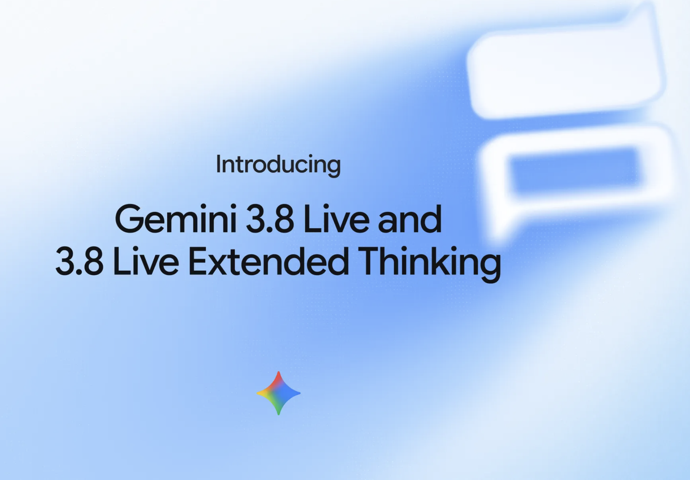

# 前情提要

我有一個自己每天在用的 LINE Bot，[linebot-helper-python](https://github.com/kkdai/linebot-helper-python)。丟網址回摘要跟社群文案，丟 YouTube 連結可以針對影片連續追問，還有書籤、地點查詢那些。其中一個功能是 LIFF 語音助理：開一個網頁，用 WebSocket 接 Gemini Live API，可以按住說話或免持對話，講完的內容會整理成一則訊息推回 LINE 聊天室。

九月中 Google 發了 [Gemini 3.8 Live](https://blog.google/innovation-and-ai/models-and-research/gemini-models/gemini-3-8-live-gemini-3-8-live-extended-thinking/)，看完之後我想做的事情，跟公告想賣的東西不太一樣。

公告在講能力：Speech to Speech Index 排第一（82.6 分）、Big Bench Audio 97.7%、97 種語言自動偵測且可以在對話中途切換、工具呼叫可以在背景執行而不中斷對話流、即時視覺輸入。還有一顆 `Gemini 3.8 Live Extended Thinking`，能一邊推理一邊出聲。

我第一個念頭是：**這下我可以把那個 preview 例外拔掉了。**

---

# 真正的動機：一個 preview 模型埋了兩次雷

上一篇寫 agentic video 的時候提過一件事：我的智慧對話功能壞了整段時間，沒有人發現。原因是 `loader/chat_session.py` 寫死了 `gemini-3-pro-preview`，那個模型從 Vertex AI 下架之後，真實路徑直接回 404，而那個檔案的例外處理是直接 raise。

修完之後我加了一組守衛，用測試強制「模型 ID 只能出現在 `config/agent_config.py`」「不准使用 preview 或實驗模型」。但那組守衛有兩個例外：

```python
# Live API 僅支援 gemini-3.1-flash-live-preview；TTS 是獨立模型家族。
# 這兩處必須維持 preview 模型，不在守衛範圍內。
EXEMPT_FILES = {"services/voice_live.py", "tools/tts_tool.py"}
```

語音那個例外的理由是「Live API 只有這一顆模型能用」。當時是真的。但那句話一旦寫進註解，就沒有人會再去查它還成不成立——同一類 bug 的最後一個缺口，就這樣光明正大掛在那裡好幾個月。

3.8 Live 的意義因此不只是能力升級。它的模型名稱**不含 `-preview`**，這代表那個例外可以縮掉。

---

# 先問 API，不要問文件

這次我沒有先讀文件，而是直接問 API 上實際存在哪些東西：

```bash
curl -s "https://generativelanguage.googleapis.com/v1beta/models?key=$KEY&pageSize=200" \
  | jq -r '.models[]?.name' | rg -i 'live'
```

```
models/gemini-3.5-transcribe-live
models/gemini-3.1-flash-live-preview
models/gemini-3.8-live
models/gemini-3.8-live-extended-thinking
models/gemini-3.5-live-translate-preview
```

一行指令拿到五個確定存在的模型名稱，比在文件裡翻半天可靠。`gemini-3.8-live` 就在上面，名字乾淨。

順帶還撿到一個我本來不知道的 `gemini-3.5-live-translate-preview`。我原本在想「要不要做即時口譯模式」，看來那是一顆專門的模型，不是拿通用模型硬幹。這個之後再說。

再往下問 metadata：

| | `3.1-flash-live-preview` | `3.8-live` |
|---|---|---|
| inputTokenLimit | 131072 | 131072 |
| outputTokenLimit | 65536 | 65536 |
| supportedGenerationMethods | `bidiGenerateContent` | `bidiGenerateContent` |

數字一模一樣。到這裡我對「可以無痛換」有了初步信心，但這還只是 metadata，不是行為。

---

# 踩坑一：我警告了一個不存在的風險

我第一次評估這件事的時候，很嚴肅地提醒了一句：「公告沒提到 Vertex AI，而這個專案的決策是全面改用 Vertex，所以 3.8 Live 不確定拿不拿得到。」

聽起來很專業。然後我去翻自己的程式碼：

```python
client = live_genai.Client(
    api_key=GOOGLE_AI_API_KEY,
    vertexai=False,
    http_options={"api_version": "v1beta"},
)
```

`vertexai=False`。語音這條路徑從一開始就是走 Gemini API 加 AI Studio 的金鑰，根本不走 Vertex——而 3.8 Live 正是在 Gemini API 上發表的。

我對著自己的 repo，警告了一個在自己 repo 裡不存在的風險。整個專案確實「全面改用 Vertex AI」，但語音是例外，而那個例外是我自己當初寫的。

**原因與解法**：專案層級的決策紀錄會變成一種記憶捷徑。「我們都用 Vertex」是對的總結，但總結會吃掉例外。查一次原始碼只要三十秒，比憑印象推論便宜太多。

---

# 踩坑二：對照組救了我一次

確認模型存在之後，我寫了一支拋棄式腳本去實測。關鍵設計是：**不另外寫一份 config，直接 import 專案裡現有的 `build_live_config()` 跟 `build_voice_tools()`**。要測的是「我現在正在跑的這套設定能不能用」，不是「我另外寫一套能不能用」。

第一次跑出來是這樣：

```
=== gemini-3.8-live ===
  [handsfree] {'connected': True, 'audio': True, ..., 'error': None}
  [PTT]       {'connected': True, 'audio': False, ...,
               'error': 'APIError: 1007 None. Precondition check failed.'}
```

按住說話那個模式直接被擋。如果我只測了 3.8，這裡就會得到一個結論：「3.8 Live 不支援 PTT，不能升級。」

但我把舊模型也放進去跑了：

```
=== gemini-3.1-flash-live-preview ===
  [PTT]       {..., 'error': 'APIError: 1007 None. Precondition check failed.'}
```

一模一樣的錯誤。兩個模型用同一種方式失敗，那就不是模型的問題，是我的腳本有問題。

實際上的錯是：PTT 模式下正式環境送的是 PCM 音訊，我圖方便送了文字。`activity_start` 跟 `activity_end` 之間夾一段文字輸入，本來就是不合法的組合。

改成送真實的 16kHz PCM 之後：

```
=== gemini-3.8-live ===
  [PTT] {'connected': True, 'audio': True, 'out_tx': True, 'in_tx': True,
         'resume': True, 'events': ['audio','in_tx','out_tx','resume','turn_complete']}
```

全部到齊，而且跟舊模型逐項一致。

**原因與解法**：這次唯一做對的事情是**保留了對照組**。測一個新東西的時候順手把舊東西用同樣方式測一遍，成本幾乎是零，但它能分辨「新東西壞了」跟「我的測試寫錯了」。這兩件事看起來長得一模一樣。

---

# 踩坑三：正弦波不是人聲

第二版腳本我用 `math.sin` 產了一段 180Hz 的 PCM 當作音訊輸入。PTT 模式測得很順，但免持模式兩個模型都 timeout。

我差點把這個寫成「免持模式行為待確認」。但想一下就知道為什麼：免持模式靠的是 Gemini 自己的語音活動偵測，而一段純正弦波不是語音，VAD 正確地判斷「沒有人在講話」，所以永遠不會觸發。

所以那不是「測出問題」，是**完全沒測到**。兩次 timeout 看起來像資料，實際上是兩個空格。

這件事後來延伸出一份清單。我把腳本測到的跟沒測到的分開列：

測到了：連線、config 被接受、PTT 音訊往返、雙向逐字稿、resumption handle、turn_complete、工具呼叫觸發且參數正確。

**沒測到**：真人中文語音辨識、免持自動 VAD、說話中插話打斷、十分鐘連線回收後的重連、resumption handle 帶回去能不能真的接上上下文、Google Search grounding 實際生效、慢任務轉交推回 LINE 的後半段、語音品質與延遲。

八項裡沒測到的有八項。腳本跑得很漂亮，但它碰到的是協定層，不是使用者會遇到的東西。

---

# 實測對照表

繞完一圈之後，最後的對照長這樣。左右兩欄都是用**專案現有的 config 產生器**打真實 API 的結果：

| 驗證項目 | `3.1-flash-live-preview` | `3.8-live` |
|---|---|---|
| PTT（activity 信號 + PCM 分塊） | 音訊／雙向逐字稿／resume／turn_complete | 相同 |
| `session_resumption` | 有 | 有 |
| `context_window_compression` | 接受 | 接受 |
| 雙向 `AudioTranscriptionConfig` | 有 | 有 |
| 語音 `Aoede` | 有 | 有 |
| `google_search` 與 `function_declarations` 分屬兩個 Tool | 接受 | 接受 |
| 工具呼叫實際觸發 | 兩個工具參數皆正確 | 相同 |
| `api_version="v1beta"` | 需要 | 仍然需要 |

換句話說，`gemini-3.8-live` 對既有設定是可以直接換上去的。

---

# Extended Thinking 有一個必填欄位

順手也測了 `gemini-3.8-live-extended-thinking`，連線直接被擋：

```
APIError: 1007 None. Thinking level must be specified for this model.
```

補上 `thinking_config` 之後 `LOW` 跟 `HIGH` 都可以連。所以它不是壞的，是多一個必填參數。

我決定不採用，理由是現在的 `build_live_config()` 不送 `thinking_config`。如果只是把模型名稱換掉，語音助理會在連線那一步直接掛掉。要用它得先改設定產生器，那是另一件事。

但「我知道不能設」這件事保不住，所以寫成測試：

```python
# Live API（bidiGenerateContent）支援名單。2026-09-16 實測連線確認。
# 刻意不含 gemini-3.8-live-extended-thinking：該模型強制要求 thinking_level，
# 未帶 thinking_config 連線會被擋下（1007）。
LIVE_CAPABLE = {"gemini-3.8-live"}
```

上一次我在註解裡寫「Live API 只支援某個模型」，那句話過期了好幾個月沒人發現。這次我把它寫成一個會失敗的斷言。

---

# 改了什麼

實際的程式改動很小，七個檔案、八十行上下：

- **`config/agent_config.py`**：新增 `VOICE_MODEL` 模組常數與 `AgentConfig.voice_model`。這裡有個細節——我刻意沒有只放進 `get_agent_config()`，因為那個函式要求 `GOOGLE_CLOUD_PROJECT`，而 `services/voice_live.py` 在 import 的時候就需要模型 ID。走那條路的話，沒設專案環境變數就會連 import 都失敗。
- **`services/voice_live.py`**：模型字面值整個拿掉，改從 config 拿。
- **`tests/test_model_config.py`**：`EXEMPT_FILES` 從兩個檔縮成一個；`voice_model` 納入既有的「不得 preview」與「必須在實測可用清單內」兩個守衛。

最後那個守衛本來長這樣：

```python
def test_voice_live_model_unchanged():
    """Live API 只支援 gemini-3.1-flash-live-preview，換掉會讓語音助理整個壞掉。"""
    assert VOICE_MODEL == "gemini-3.1-flash-live-preview"
```

它斷言的是一個字串。字串會過期，而且過期的時候測試還是綠的——它只會在你想升級的時候擋你的路，不會在模型下架的時候救你。

改成守名單之後，守的是「這個值必須是實測可用的 Live 模型」這一類問題，不是某一個特定值。

`tools/tts_tool.py` 那個例外留著。我查了一下，API 上三顆 TTS 模型（`2.5-flash-preview-tts`、`2.5-pro-preview-tts`、`3.1-flash-tts-preview`）全都還是 preview，沒有 GA 版可以換。例外從兩個縮成一個，沒有歸零。

---

# 部署順序：設定先就位，程式碼後到

環境變數是在合併之前先設好的：

```bash
gcloud run services update linebot-helper-python --region us-central1 \
  --update-env-vars VOICE_MODEL=gemini-3.8-live
```

這一步當下**完全沒有作用**。線上跑的還是舊 image，那份程式碼把模型寫死在 `voice_live.py`，根本不會去讀這個變數。

但順序是對的。合併會觸發 Cloud Build 自動部署，新 image 一上去就直接讀到已經就位的設定，中間不會有一個「程式碼上了但設定還沒」的空窗。

這個做法還有一個副作用，我覺得比升級本身更有價值：**回滾不需要重新部署**。

```bash
gcloud run services update linebot-helper-python --region us-central1 \
  --update-env-vars VOICE_MODEL=gemini-3.1-flash-live-preview
```

如果真人測起來覺得不對，一行指令就切回去，不用等 build。模型 ID 從寫死改成環境變數，換來的就是這個。

---

# 然後我真人測了，結果推翻了我的觀察

腳本裡有一件事我一直覺得可疑。工具呼叫那一輪，舊模型會先出聲講一句填充話再等工具結果，3.8 沒有。

我當時的判斷很小心：這**可能**就是公告講的「工具在背景執行不中斷對話流」，也可能只是我的迴圈提早收掉。自動化測不出來，得真人講話才知道是改善還是冷場。

合併部署之後實際用 LIFF 講了幾句，答案是：**跟原來沒有差別，很順暢。**

所以那個差異在真人耳裡不存在。它是我 drain 迴圈在拿到 `turn_complete` 就 return 的產物，不是行為改變。我觀察到的是自己腳本的形狀。

這篇文章裡我的腳本因此騙了我三次：PTT 那次讓新模型看起來壞了，正弦波那次讓沒測到看起來像測過了，這次讓一個不存在的差異看起來像新能力。三次都不是模型的問題。

---

# 296 個測試全綠，證明不了語音能用

這是我覺得整件事最值得寫下來的部分。

升級完成後測試從 293 變成 296，全綠。但這個數字跟「語音在 3.8 上能不能用」幾乎沒有關係。

`tests/test_voice_live.py` 有 32 個測試，涵蓋 PTT 停用自動 VAD、activity 信號、逐字稿轉發、工具呼叫執行、resumption handle、連線回收、插話打斷。看起來很完整。但它們全部使用 `FakeLiveSession`，不連網。模型從 3.1 換成 3.8，這 32 個測試一個字都不會變色。

它們測的是「我送出去的東西長得對不對」，不是「對面回什麼」。

三層覆蓋攤開來是這樣：

| 層 | 測什麼 | 誰跑 | 可重複 |
|---|---|---|---|
| repo 測試套件（296 個） | 送出去的 config 與訊息格式 | CI 每次 push | 可以 |
| 拋棄式 probe（3 支） | 真實 API 的協定層相容性 | 只跑過一次 | 不行 |
| 真人對話 | 聽不聽得懂、順不順 | 我自己 | 不行 |

中間那層才是唯一碰到 3.8 的自動化測試，而它不在 repo 裡、CI 不會跑、下次模型下架的時候不會有人知道。

新加的守衛也只擋得住「設成一個已知會壞的值」，擋不住「Google 把 3.8-live 也下架了」——也就是上次真正發生的那件事。

這個缺口還開著。把 probe 收成一個需要金鑰才跑的 smoke test 是解法，我還沒做。

---

程式碼在 [kkdai/linebot-helper-python](https://github.com/kkdai/linebot-helper-python)，這次的改動在 PR #24。官方公告是 [Gemini 3.8 Live](https://blog.google/innovation-and-ai/models-and-research/gemini-models/gemini-3-8-live-gemini-3-8-live-extended-thinking/)，裡面提到所有 AI 生成的音訊都帶 SynthID 浮水印，這點我沒有驗證。

公告花最多篇幅講的即時視覺輸入，我這次完全沒碰——目前 LIFF 那支 `getUserMedia` 是寫死 `video: false` 的。那大概是下一篇。
