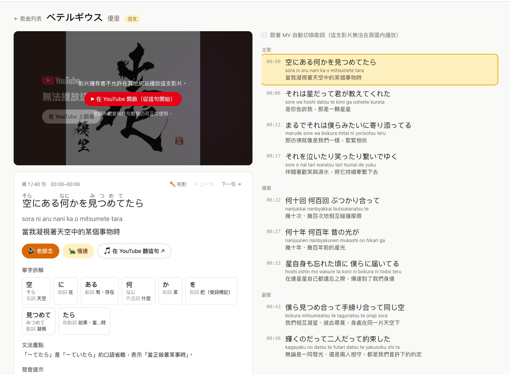

# 前情提要

每次看到 Gemini 出新功能，我第一個念頭都是「能不能接進我的 LINE Bot」。

9/22 的 [Gemini API release notes](https://ai.google.dev/gemini-api/docs/changelog) 寫著 **Gemini 3.8 Flash TTS 與 Gemini 3.8 Flash-Lite TTS 正式推出（GA）**，官方部落格同步發了 [Gemini 3.8 Flash TTS and Gemini 3.8 Flash-Lite TTS](https://blog.google/innovation-and-ai/models-and-research/gemini-models/gemini-3-8-text-to-speech/)。我照慣例先列了一排 LINE Bot 點子：爸媽聲音的睡前故事、把群組聊天變成廣播劇、早晨雙主持人 podcast⋯⋯

列到一半我發現，這次最打動我的其實不是 bot，而是「**逐句導演語氣**」這件事特別適合拿來教發音。於是題目改成一個 Web App：

1. 選一首歌，拿到歌詞，同步翻成中文。
2. 如果是日文、韓文，就附上拼音，然後變身語言老師，一句一句教你怎麼念。
3. 變成一個「用歌曲學語言」的工具。

結果做下來，TTS 本身的品質沒什麼好挑的，真正花時間的是它周邊那些文件沒寫的事。

---

# Gemini 3.8 Flash TTS 是什麼

這次 GA 的是兩個模型：

| 模型 | 定位 |
|---|---|
| `gemini-3.8-flash-tts` | 旗艦款，重視聲音表現與角色塑造，可以逐句控制演出 |
| `gemini-3.8-flash-lite-tts` | 便宜、快，適合大量產生 |

跟前一代比，多了三個我覺得真正有用的東西：

- **Voice design**：用一段文字描述生出一個聲音，例如「一位 60 多歲、帶英國腔、語氣溫暖的天文學家」。生出來的聲音會拿到一個 `voice_id`，之後重複使用。
- **Voice replication**：用 10–30 秒的錄音複製一個人的聲音。前提是聲音主人要親口錄一段同意聲明，產出的語音也會帶 SynthID 浮水印與 C2PA 標記。
- **逐句的演出控制**：每一段文字都能附一個 `style`（例如「慢慢念、每個音節都念清楚」），也支援 `<laughs>`、`<sigh>` 這類標籤，以及最多兩人的對話。

實際呼叫的長相，跟過去的 `generate_content` 不一樣，改走 `interactions` 與 `voices` 兩組 API：

```python
# 用文字描述設計一個聲音（一次性，存起來重複用）
voice = client.voices.create(
    store=True,
    voice={
        "model": "gemini-3.8-flash-tts",
        "type": "prompted",
        "display_name": "Song Lingo Japanese Teacher",
        "gender": "female",
        "language_code": "ja-JP",
        "prompted": {"input": "A warm, patient Japanese language teacher in her early 30s from Tokyo..."},
    },
)

# 用這個聲音念一句話，style 控制語氣與速度
interaction = client.interactions.create(
    model="gemini-3.8-flash-tts",
    input=[{
        "type": "user_input",
        "content": [{
            "type": "text",
            "text": "こんにちは。今日はいい天気ですね。",
            "annotations": [{"type": "speech_metadata", "style": "speaking slowly and clearly"}],
        }],
    }],
    response_format={"type": "audio"},
    generation_config={"speech_config": [{"voice": voice.id}]},
)
```

幾個規格面的細節，做之前先知道會省很多事：

| 項目 | 規格 |
|---|---|
| 輸出格式 | WAV，16-bit PCM、單聲道、24 kHz；也支援串流 |
| 語言 | 100 種以上，語言表裡有簡體中文、繁體中文、粵語；**沒看到台語** |
| 自訂聲音上限 | 每個專案 200 個，保存 1 年；也可以選自己保管的 `voicekey_`，7 天有效 |
| Voice replication 地區限制 | 伊利諾州、德州、歐洲經濟區、英國、瑞士、印度不能用 |
| 價格 | 公告與文件都沒寫 |
| **Tier 1 額度** | **每天 100 次請求**（這個後面會變成主角） |

---

# 做之前先處理的事：歌詞的版權

「輸入歌名，自動上網抓歌詞」是最直覺的做法，但它卡在兩個地方：

- **版權**：歌詞網站是付費取得授權才能顯示的。自己的 App 抓來顯示全文、再附上翻譯（翻譯在法律上算改作），公開上線就有侵權風險。
- **技術**：就算用 Gemini 搭配 Google Search 去抓，Gemini 有防止重現受版權保護文字的機制，常會直接回 `finishReason: RECITATION`。

後來我想到另一條路：**把 YouTube MV 網址直接丟給 Gemini，請它把歌詞轉錄出來。** 技術上完全可行，Gemini API 本來就吃公開的 YouTube 網址。

但這裡要講清楚：**換一種方式取得歌詞，並不會讓它變合法。** 不管是從網站抓、自己打字、還是讓 AI 從 MV 聽寫，拿到的都是同一份受保護的文字。決定風險的是你怎麼用它。

所以我的決定是：這是個人學習工具，歌詞只存在本機的 `output/` 資料夾，而且這個資料夾從第一個 commit 就放進 `.gitignore`，永遠不會出現在 GitHub 上。開發過程中我也要求 Claude Code 驗證資料時**只印統計數字**，從頭到尾沒有把歌詞印到終端機或寫進任何 log。

---

# 架構：三支 Python 腳本 + 一個 Next.js

```
YouTube 網址
  ─transcribe.py─▶ 歌詞與時間軸
  ─annotate.py──▶ 拼音、翻譯、單字拆解、文法重點
  ─speak.py────▶ 老師示範音（正常速 / 慢速）
  ─Next.js─────▶ 跟著 MV 逐句學
```

## 轉錄：讓 Gemini 優先讀 MV 畫面上的字幕

`transcribe.py` 把 YouTube 網址當成 `file_data` 丟給 `gemini-3.8-flash`，用 structured output 要求每一句都有開始結束時間、原文、日文的平假名讀音，以及一個「沒聽清楚」的旗標。

prompt 裡最關鍵的一句是：**如果 MV 畫面上有歌詞字幕，優先用字幕。** 唱歌的轉錄比說話難很多，有伴奏、拉長音、和聲；日文還有同音字的問題，聽到「kimi」不知道歌詞寫的是「君」還是「きみ」。有字幕的話，Gemini 同時看畫面跟聽聲音，準確度會好很多。

我拿三首歌測：

| 歌曲 | 語言 | 歌詞來源 | 句數（不重複） |
|---|---|---|---|
| 優里〈ベテルギウス〉 | 日文 | 聽音訊 | 40（23） |
| 優里〈クリスマスイブ〉 | 日文 | 畫面字幕 | 45（35） |
| Take That〈Back for Good〉 | 英文 | 聽音訊 | 37（26） |

結構都完整：沒有空白句、時間沒有倒退、沒有連續重複同一句（模型出錯時常見的症狀）。唯一讓我不放心的是**每一句都標「確定」**，連靠聽的那兩首都是。模型對自己太有自信了，這件事後面會用另一個方法補。

## 標註：拼音不要全交給 LLM

`annotate.py` 替每一句加上繁體中文翻譯、逐字拆解（讀音、詞性、意思）、一個文法重點和一個發音提示。副歌會重複出現，所以只替**不重複的句子**呼叫 Gemini，大約省下三到四成。

拼音是這一段最有意思的地方。我原本的想法是用現成的函式庫，比 LLM 可靠，結果兩個都出事：

- **pykakasi**（日文）把助詞「は」拼成 `ha`，正確念法是 `wa`。光看平假名，分不出這個「は」是不是助詞。
- **korean-romanizer**（韓文）把「감사합니다」拼成 `gamsahapnida`。韓國官方的 Revised Romanization 要照實際發音拼，應該是 `gamsahamnida`，這個套件沒處理鼻音化。

最後的分工是：

- **日文**：Gemini 負責斷詞並給出每個詞的讀音和詞性，程式再用 pykakasi 轉成羅馬拼音，並依詞性把助詞 は、へ、を 修正成 wa、e、o。
- **韓文**：韓文字本身就是表音文字，直接請 Gemini 照 Revised Romanization 的發音規則輸出。

**原因與解法**：函式庫擅長的是「確定性的轉換」，不擅長「需要理解上下文的判斷」；LLM 剛好相反。把需要理解的部分（斷詞、詞性）交給 LLM，確定性的部分（假名轉拼音）交給程式，兩邊都用在它擅長的地方。

## 用兩次獨立的結果交叉檢查

前面說轉錄結果每一句都標「確定」，不太可信。我補的方法是：轉錄時 Gemini 已經給過一次整句讀音，標註時又給了每個詞的讀音。**這兩次是分開產生的，對不上的句子，最可能是漢字念錯了。**

實際跑下來，兩首日文歌各有 1 句對不上（1/23、1/35），程式會替它加上 `needs_review`，網頁就能提醒使用者校對。

這招不用多花任何 API 呼叫，只是把已經有的兩份結果拿來比對。

## 老師：用 voice design「設計」出來

`speak.py` 替每種語言設計一位老師，例如日文是「東京出身、30 出頭、溫柔有耐心的日文老師」，只建立一次，`voice_id` 存起來重複使用。每一句產生兩段音檔：

| | 正常速 | 慢速 |
|---|---|---|
| 長度 | 2.5–6.1 秒，平均 4.3 秒 | 4.4–9.7 秒，平均 7.1 秒 |
| 慢速／正常 | | 每句至少 1.24 倍，最多 2.34 倍 |

慢速只靠一句 `style` 描述，沒有調任何播放速度，而且是「念得慢而清楚」，不是把正常速度的音檔拉長。這是這次 TTS 讓我最有感的地方。

## Web App：Next.js 16

網頁用 Next.js，由伺服器端直接讀 `../output/` 的資料。畫面左邊是嵌入的 MV，下面是這一句的教學卡片（漢字上方標假名、拼音、翻譯、單字拆解、文法、發音提示，以及「老師念」「慢速」「原曲這句」三顆按鈕）；右邊是整首歌的逐句列表，會跟著 MV 播放自動切換。

一開 `create-next-app` 就遇到一個有意思的東西，它產生的 `AGENTS.md` 第一行寫著：

> This is NOT the Next.js you know

意思是這個版本有破壞性變更，要 agent 先讀 `node_modules/next/dist/docs/` 再寫程式。Claude Code 照做了，`params` 變成 Promise、route handler 的 `RouteContext` 型別都是從那裡查到的。框架主動寫給 AI 看的說明文件，我覺得是個會越來越常見的做法。

---

# 額度：Tier 1 每天只有 100 次

這是整個專案最重要的限制，所以先講。

`gemini-3.8-flash-tts` 在 Tier 1 **每天 100 次請求**。一首歌 30 幾句、每句正常速加慢速兩段，大約就要 50–70 次。**照這個額度，一天只能處理一到兩首歌。**

所以後來我把 `speak.py` 批次產生的做法，改成**使用者按下播放時才產生**，產生後存起來：

| 動作 | 會消耗 Gemini 嗎？ |
|---|---|
| 看歌詞、翻譯、單字拆解 | 不會 |
| 播放 MV、按「原曲這句」 | 不會，那是 YouTube 播放器 |
| 播放已經產生過的示範音 | 不會 |
| **第一次**播放某一句的示範音 | 1 次 TTS（正常速、慢速分開算） |
| 加入新歌 | 約 2 次 Gemini Flash，不佔 TTS |

音檔用句子內容的雜湊值命名，重複出現的副歌自然共用同一段音檔。只有真的練到的句子才會花額度。

---

# 踩坑一：程式「卡住」了，其實是在睡七小時

替第二首歌批次產生音檔時，進度停在 56/70 不動了。

查下去的狀態很奇怪：Python 程式還在、CPU 0%，4 個 worker 各自連著 Google 的伺服器乾等。第一個判斷是請求沒有逾時設定，於是加了 60 秒 timeout 跟重試。重跑之後，十分鐘只多了 1 段，而且這次**連網路連線都沒有了**。

關掉 SDK 的自動重試、直接看回應，答案才出來：

```
429 Rate limit exceeded for model gemini-3.8-flash-tts
(limit: 100 requests per day on Tier 1). Please retry in 7h12m16s
retry-after: 25936
```

每日額度用完了，而 SDK 收到 429 之後，**照著 `Retry-After` 乖乖等 25,936 秒再重試**。從外面看，就是一個不吃 CPU、不連網路、永遠不會結束的程式。

更麻煩的是，我一開始用 `HttpRetryOptions(attempts=1)` 想關掉重試，完全沒效。原因是 `interactions` 這組 API 走的是 SDK 裡另一套 HTTP client（模組名稱是 `_gaos`），不吃 `HttpRetryOptions`，要改它自己的設定：

```python
client = genai.Client()
# 這組 API 不吃 HttpRetryOptions；不關掉的話，遇到每日額度會睡好幾個小時
client.interactions.sdk_configuration.retry_config.max_retries = 0
```

**原因與解法**：「尊重 `Retry-After`」對每分鐘的限速是好設計，對每日額度就是災難。現在程式自己處理重試：暫時性錯誤最多試 3 次；遇到訊息含「per day」的 429，所有 worker 立刻停下來，印出還要等多久，已經產生的音檔都保留。

---

# 踩坑二：Python SDK 有的欄位，REST 沒有

這是這次最貴的一課。

改成「按下播放才產生」之後，產生音檔的工作從 Python 搬到了 Next.js 的伺服器端，用 `fetch` 直接打 REST API。Python 版本讀音訊是這樣寫的：

```python
audio = base64.b64decode(interaction.output_audio.data)
```

TS 版本就照著寫了 `json.output_audio?.data`。問題是，**REST 回應裡根本沒有 `output_audio` 這個欄位。**

翻 SDK 原始碼才知道，`output_audio` 是 Python SDK 在 pydantic validator 裡**自己算出來的便利欄位**：它從 `steps` 陣列裡找 `type: "model_output"` 的步驟，再從步驟的 `content` 裡取出 `type: "audio"` 的項目。真正的 REST 回應長這樣：

```
steps[] → { type: "model_output", content[] → { type: "audio", data: "<base64>" } }
```

於是發生了這件事：

1. Gemini 每一次都**成功產生了音訊，也算進了額度**。
2. 我的程式讀不到音訊，回傳 502，沒有存檔。
3. 使用者每按一次播放，加上瀏覽器自己送出的多個 Range 請求，都**再呼叫一次 TTS**。

**大約一個小時內，100 次額度全部用完，`output/audio/` 裡一個新檔案都沒有。**

更難看的是，這段程式碼上線的時候，因為當天額度已經用完，成功回應的格式根本沒辦法驗證。Claude Code 在交付時有把「成功路徑未驗證」寫在報告裡，但我們還是讓它上線了。

**原因與解法**：分兩層修。

- **照 SDK 的邏輯解析**：依序找 `steps`、舊格式的 `outputs`，最後才是 `output_audio`。沒有額度可以打 API 驗證，所以拿同一份模擬回應分別餵給 Python SDK 的解析器和新的 TS 函式，確認兩邊取出的資料一致。後來額度空出一個名額，第一段英文音檔真的產生並存下來了（5.04 秒、24 kHz），這才算真正驗證。
- **防止失敗時重複計費**：同一段音檔產生失敗後的 60 秒內，直接回傳上次的錯誤；收到 429 之後，所有音檔一律擋到 `Retry-After` 指定的時間為止。

```ts
// A failed generation may still have been billed, so don't let repeated clicks or the
// browser's parallel range requests retry it: replay the error for a while instead.
const recentFailures = new Map<string, { error: TtsError; until: number }>();
```

這個 bug 教我的是：**失敗不等於沒有花錢。** 只要請求送到了模型、模型也跑完了，就算你的程式在最後一步解析失敗，帳單照樣算。會消耗額度的程式，一定要在上線前看過一次真正的成功回應，而且失敗路徑要預設「這次可能已經被計費了」。

---

# 踩坑三：`.env` 裡的引號

Next.js 端第一次打 API，回的是：

```
400 API key not valid. Please pass a valid API key.
```

同一把 key，Python 用得好好的。檢查 `.env` 的格式（只看長度和頭尾字元，不印出 key）才發現，我的 key 寫成 `GEMINI_API_KEY="..."`，**有雙引號**。Python 的 `python-dotenv` 會自動去掉引號，Node 端自己寫的讀取程式沒有，就把引號一起當成 key 送出去了。

順帶還抓到另一個問題：Gemini 的錯誤回應有時是陣列 `[{ "error": ... }]` 而不是物件，所以原本的程式連錯誤訊息都讀不到，畫面上只顯示空白的「400：」。

**原因與解法**：讀取 `.env` 的邏輯改成跟 python-dotenv 一致（允許 `export` 前綴、去掉引號），錯誤解析兩種格式都處理。小事，但兩個語言共用一份設定檔時，這種「一邊會自動幫你處理」的差異特別容易漏。

---

# 踩坑四：音檔用行號命名，一校對就全部錯位

轉錄一定會有錯，所以我加了校對介面：卡片上可以直接改原文、讀音、翻譯，或按「✓ 沒問題」一鍵確認；改了原文之後，按「重新分析整首」會重跑一次 `annotate.py`（1 次 Flash 請求），而且保留手動修改的翻譯和已校對的標記。

動手之前先發現一個問題：音檔原本是依「第幾個不重複的句子」命名的，例如 `028_normal.wav`。**只要改了某一句歌詞，後面句子的編號可能跟著移動，已經產生的音檔就會對到錯的句子。**

**原因與解法**：改成用句子內容的雜湊值命名：

```python
def clip_name(text: str, speed: str) -> str:
    """Clips are keyed by line content so editing a lyric only invalidates that line's audio."""
    return f"{hashlib.sha1(text.encode()).hexdigest()[:16]}_{speed}.wav"
```

改了一句歌詞，只有那一句的音檔失效，其他全部不受影響。已經產生的 103 段音檔全部搬成新檔名，已經花掉的額度沒有浪費。Python 和 TS 兩邊各算一次同一段日文的雜湊值，確認完全一致後才上線。

---

# 踩坑五：有些 MV 不給嵌入

試用時發現有些影片在頁面裡播不出來。YouTube 播放器遇到「影片擁有者不允許在其他網站播放」時，會回報錯誤碼 101 或 150。

現在偵測到這些錯誤，影片區塊會換成縮圖、說明原因，加一顆「在 YouTube 開啟（從這句開始）」的按鈕，「原曲這句」也變成開新分頁並跳到那一句的時間點。老師示範音和逐句教學照常可用。

縮圖這邊又有一個小坑：高解析的 `maxresdefault.jpg` 不是每支影片都有，但 YouTube 找不到時**不會回 404，而是回一張 120×90 的灰色預設圖**，所以 `` 不會觸發，畫面上就是一片放大的灰色。

**原因與解法**：圖片載入後檢查寬度，不到 121 像素就換成一定存在的 `hqdefault.jpg`。

---

# 開發流程：讓 Claude Code 驗證，但不讓它看到歌詞

這次整個專案都是跟 Claude Code 一起做的，從查 changelog、討論產品方向到寫程式、部署規劃。幾個我覺得做對的地方：

- **邊做邊推上 GitHub**：每完成一個階段就 commit、push，commit message 寫清楚「為什麼」，而不只是「改了什麼」。
- **驗證只看統計數字**：檢查轉錄品質時，看的是句數、時間是否倒退、有沒有連續重複、讀音裡有沒有混進漢字；檢查音檔看的是長度、慢速倍率、有沒有異常長的檔案。從頭到尾不需要把歌詞印出來。
- **測試用假歌曲**：測校對、重新分析、影片無法嵌入時，用一首自己編的假歌（內容是「駅まで歩く」這種測試句），放進 `output/` 測完就刪，不動到真實資料。
- **用無頭 Chrome 實際點按鈕**：伺服器端的 API 測過還不夠，播放、校對、加入新歌的流程都用 puppeteer 實際點過一輪。「沒聲音」那次，也是靠它確認了 Chrome 端的播放本身是正常的，才把範圍縮小到伺服器端。

也有做錯的地方，前面兩個踩坑都是：

- 在成功回應格式沒驗證的情況下，讓會消耗額度的程式上線（踩坑二）。
- 背景處理「加入新歌」的工作完成後，狀態一直留在記憶體裡；如果之後檔案被刪掉，重新加入時會說「已完成」而不重做。這是寫「從中斷處接著做」的測試時自己抓到的，改成以磁碟上的檔案為準。

---

# 成果與效益



| | 數字 |
|---|---|
| commit | 11 |
| 已加入的歌曲 | 3 首（日文 2、英文 1） |
| 已產生的老師示範音 | 104 段 |
| 單段示範音產生時間 | 約 5 秒 |
| 加入一首新歌 | 約 48 秒（轉錄 14 秒、分析 34 秒） |
| 一首歌的 API 用量 | 約 2 次 Flash，示範音按需產生 |

現在的功能：

- 貼 YouTube 網址加入新歌，背景自動轉錄與分析。
- 跟著 MV 逐句學：假名、拼音、翻譯、單字拆解、文法、發音提示。
- 老師示範音，正常速與慢速，第一次播放時才產生。
- 校對介面：修改歌詞、一鍵確認、重新分析整首。
- 影片不能嵌入時的替代畫面。

## 下一步：搬上 Cloud Run

目前還只能在自己的電腦上跑。接下來打算部署到 GCP：

- **Cloud Run** 跑 Next.js，容器裡一併裝 Python 和 uv，三支腳本不用改。
- **GCS** 存音檔和歌曲資料。播放時由 API 產生短時效的簽署網址讓瀏覽器直接抓，GCS 本身支援 Range，Safari 也能播。
- **Secret Manager** 放 API key。
- **IAP** 把整個服務鎖起來，只有我的 Google 帳號能用。這一步不是可有可無：網站一旦公開，別人加歌、播放都會消耗我的額度；更重要的是頁面上有完整歌詞和翻譯，公開就不再是「個人學習」了。

## 幾個我會帶走的東西

**SDK 的便利欄位不是 API 的一部分。** `output_audio` 在 Python 裡用起來理所當然，但它是 SDK 自己組出來的。換語言、換成直接打 REST 的時候，要回去看真正的回應長什麼樣子，而不是照抄另一個 SDK 的寫法。

**「尊重 Retry-After」要看是哪一種限制。** 每分鐘限速時等幾秒是好事，每日額度時等七小時就是一個看起來當掉的程式。遇到額度類的錯誤，快速失敗、把原因講清楚，比默默重試有用得多。

**失敗的請求可能已經被計費。** 會花錢的操作，失敗路徑要假設「這次已經花了」，並且防止重試風暴。這次如果一開始就有 60 秒的失敗快取，損失會是幾次請求，而不是一整天的額度。

**把 LLM 和確定性程式用在各自擅長的地方。** 斷詞與詞性交給 Gemini，假名轉拼音交給 pykakasi；兩次獨立產生的讀音拿來互相比對，不用多花一次呼叫就能找出可能念錯的地方。

**版權的問題要在寫第一行程式之前想清楚。** 換一種方式取得歌詞不會讓它變合法。這次的做法是從第一個 commit 就把資料夾排除在 git 之外、驗證時只看統計數字、部署時用 IAP 鎖住，讓它從頭到尾都是一個個人學習工具。

程式碼在 [kkdai/song-lingo](https://github.com/kkdai/song-lingo)（歌詞資料不在 repo 裡，要自己加歌）。TTS 的官方文件是 [Speech generation](https://ai.google.dev/gemini-api/docs/speech-generation) 與 [Voice design](https://ai.google.dev/gemini-api/docs/voice-design)；如果你也要從 Node 或其他語言直接打 REST，記得音訊在 `steps[].content[]` 裡，不在 `output_audio`。
